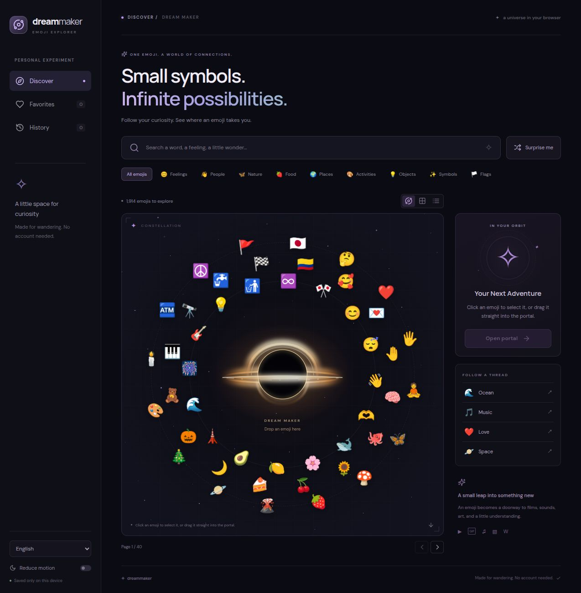
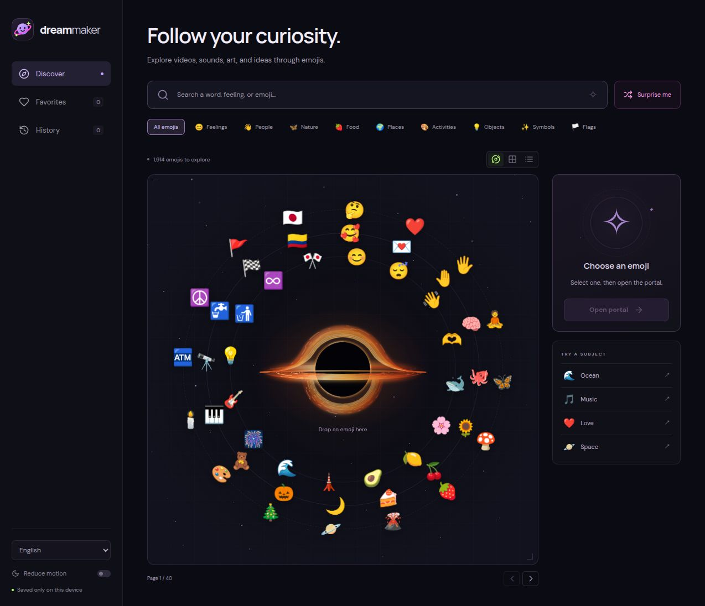

# Dream Maker

A personal emoji explorer: bilingual keyword search, a cosmic constellation, and a drag-and-drop portal into live media and Wikipedia context. The agreed specification is in [emoji-app-spec.md](emoji-app-spec.md).

## Architecture and future planning

- [Current architecture overview](docs/architecture-overview.md): frameworks, components, request flow, domain models, persistence, caches, provider boundaries, and diagrams.
- [Future improvements and playground plan](docs/future-improvements.md): an emoji composition editor, proposed storage and generation models, staged delivery, and other improvements. The initial Playground is now implemented; this document also describes later milestones.

## Version waypoints

These screenshots show the English **Discover** screen built from each exact Git tag, with default preferences and empty favorites/history. Captured on October 2, 2026 from local production builds at the same desktop viewport; each image includes the full page. The animated canvas is shown at one moment in its steady state.

### v0.1.0 — Initial explorer

[Release](https://github.com/juandarr/emoji-dream-maker/releases/tag/v0.1.0) · [Tagged source](https://github.com/juandarr/emoji-dream-maker/tree/v0.1.0) · [Status snapshot](docs/releases/v0.1.0.md)

The original cosmic interface: bilingual search, category filters, orbiting emojis, a golden portal, and browser-local favorites and history.



### v0.2.0 — Refined discovery and gravitational animation

[Release](https://github.com/juandarr/emoji-dream-maker/releases/tag/v0.2.0) · [Tagged source](https://github.com/juandarr/emoji-dream-maker/tree/v0.2.0) · [Status snapshot](docs/releases/v0.2.0.md) · [Changes since v0.1.0](https://github.com/juandarr/emoji-dream-maker/compare/v0.1.0...v0.2.0)

Simpler text, a new mascot, refined colors, and a rounded orange accretion disk with three orbit guides. Dragging adds directional lensing, proximity-driven acceleration, and white energy during rapid movement. This waypoint also delivers museum artwork, improved video/sound/GIF selection, expanded media controls, and more resilient loading; see the status snapshot for details.



## Start locally

Requires Node.js 22+ (Node 24 recommended).

```sh
npm install
cp .env.example .env.local
# Set the required account variables described below.
npm run dev
```

Set `BETTER_AUTH_SECRET`, `BETTER_AUTH_URL`, an absolute persistent `ACCOUNT_DB_PATH`, `INVITATION_PHRASE`, and `INVITATION_EMOJI_ID` before starting. See [account setup, migrations, and backup/restore](docs/account-setup.md). Register, activate with the invitation phrase and emoji, then sign in with your username/password.

Open [http://127.0.0.1:3000](http://127.0.0.1:3000) when that is your configured origin. The server binds to your local computer. Wikipedia and public-domain artworks require no API keys. Use any provider keys you already have; the app remains usable with unavailable-source messages when optional sources are not connected.

## Choose a theme

Use **Themes** directly below the language selector to choose **Classic** (the
default), **Cyberpunk**, **Solarpunk**, or **Retro**. In Spanish the selector is
**Temas**, with **Clasico** as the default. Your choice is saved on your account.
The black hole keeps its original appearance and behavior with theme colors and
glow; generated results, the result history grid, and the reading view retain
their original styling. Solarpunk's tilted elliptical orbits keep emojis on the
same visible paths. See the [theme design notes](docs/design/themes.md).

## Use the Playground

**Playground** has a nested **Creations** library in the sidebar, alongside Discover and its Favorites/History. Start with a blank white canvas. Open **Add emoji** for the floating searchable picker, search emojis in English or Spanish, filter by category, and sort by suggested order, name or Unicode order. Click/tap to add, or drag an emoji onto the canvas. Each instance can be moved, duplicated, deleted, given its own meaning, note, role and appearance. Click the painted shape of an object to select it; click empty canvas space, click the object again or press Esc to deselect. Tab still moves keyboard focus without adding an object outline; Enter/Space toggles selection. Selection adds a gentle glow, a two-pixel dashed frame and a small delete button. Dragging keeps selected objects selected, with their frame and controls following the movement; dragging an unselected object starts on its painted shape or a small allowance around its outer edge and leaves it unselected; distant transparent corners and enclosed holes act as canvas space; arrow keys nudge a focused instance, and Delete/Backspace removes a selected object. Scroll over the canvas to zoom at the pointer, and drag empty space to pan in any direction. Canvas emojis use the locally bundled [Noto Color Emoji 2.051 vector font](https://github.com/googlefonts/noto-emoji/tree/v2.051), preserving the original Noto artwork, colors and gradients. The COLRv1 outlines render at their actual displayed size to stay sharp on zoom and high-density screens. Glyphs, chosen skin tones and meanings remain unchanged; unsupported browsers or historical glyphs fall back to system emoji. **Fit objects in view** brings the scene back; zoom stops when an emoji fills the shorter canvas dimension. **Enter fullscreen** opens a focused workspace with the same floating picker and editing controls. The picker stays open after click, tap and drag additions, preserving its search, filters and scroll position; click outside it, use × or press Esc to close it. On touch screens, tap to add, swipe the picker to scroll, or hold an emoji briefly before dragging it out. Pointer grabs have a modest outer-edge allowance (about 12% wider at normal size, capped at 2–6 screen pixels for mouse/pen or 4–10 for touch). Enclosed holes remain empty, actual painted overlap takes priority, and area selection stays precise. Select an object to reveal the bottom-right resize handle and upper rotation handle. Resize preserves proportions and re-renders the vector font at its new size. **Select area** changes empty-space dragging to rectangle selection; Shift-drag is a shortcut, and Shift-click adds or removes individual emojis from the selection. Any painted part touched by the area selects its object, including edge contact. Transparent corners and holes, shadows and selection padding do not count. Holding Shift shows the standard arrow cursor inside the canvas; releasing it restores the current tool cursor. Drag anywhere inside the selection frame to move a group; its handles resize the whole arrangement around its center or rotate both positions and artwork together. Individual and group frames turn with the artwork; their rotation and northwest–southeast resize controls follow the frame, with the resize cursor matching its angle. The trash button or Delete/Backspace removes the selection and its relationships. Arrow keys on a resize/rotation handle adjust size or angle (Shift uses 15° rotation steps). Escape cancels an in-progress transform. Size and rotation are preserved in saved creations; older boards open at their original size and angle. Each completed drag, resize, rotation or group deletion is one undo step. The selected emoji in Discover also has **Add to playground**, preserving its chosen appearance.

The whole board is one named scene, limited to 80 symbols. Add explicit labeled relationships from the selected symbol to another. The meaning panel compiles the chosen ideas and relationships into an editable brief. Coordinates are visual placement; they do not invent relationships or narrative order. Copying the brief works without AI credentials.

The current board, Context fields, relationship editor, canvas view and result editing state remain while switching tabs. **Save creation** saves exactly what is present, including a canvas alone. **Creations** groups saved states into canvas → context/model → results; inspect or restore the complete state or chosen components. Saving edited work preserves earlier saved versions. Restoring or starting a new canvas offers Save / Discard / Cancel when the current work is unsaved. Canvas export/import has been removed in favor of this flow.

**Generate** and **Keep in session** create temporary checkpoints. They stay on your account across refresh, logout, browser changes, and server restarts until removed, without a retention cap. View, restore, save, remove individually, or select/remove in bulk with Undo. Removing temporary history leaves saved Creations and current work intact. Refresh starts a blank editor; both collections survive. Result-only restoration keeps its original inputs as a reference and cannot attach it to different inputs. **Cancel generation** releases the editor immediately and retains the canceled attempt, although upstream provider processing may continue. Failed saves retain the current work. Phase 2 stores preferences, Discovery favorites/history, and both creation collections in SQLite behind authenticated account repositories. Existing browser data is left untouched and is not imported into new accounts. See the [Phase 1 plan](docs/phase-1-creations-plan.md) and [Phase 2 plan](docs/phase-2-implementation-plan.md).

**Context** contains the scene fields and its **Add relationships** toggle. The selected-symbol editor and relationship controls expand inside that same panel. **Settings** contains output language, model and reasoning effort selectors plus their explanatory line. The adjacent information icon opens supporting details about limits, connection status and generation on pointer hover; clicks never pin it open, and leaving the icon/content, Escape, or an outside click dismisses it. Both information icons share the same hover styling.

### Connect OpenRouter

Add these private server settings to `.env.local`, then restart `npm run dev`:

```dotenv
OPENROUTER_API_KEY=your-key-here
OPENROUTER_MODEL=openrouter/free
OPENROUTER_REASONING_EFFORT=default
OPENROUTER_MAX_COMPLETION_TOKENS=8192
# Optional: comma-separated model IDs available to your account.
# OPENROUTER_MODELS=provider/model-one,provider/model-two
```

The default [OpenRouter free-model router](https://openrouter.ai/openrouter/free) selects an available free model. You can choose your own text model or configure an allowlist with `OPENROUTER_MODELS`. The UI exposes model IDs and connection configuration, never the key. **Check connection** checks server configuration; it does not spend credits or validate the key with the provider. Never put a private key in `NEXT_PUBLIC_` variables.

Choose a model in **Text model**, then a **Reasoning effort** (Model default, Low, Medium or High). The picker uses your `OPENROUTER_MODELS` allowlist; without it, `OPENROUTER_MODEL` supplies the single choice. An explicit reasoning effort is sent using OpenRouter’s unified `reasoning.effort` and requires a provider that supports those settings. `OPENROUTER_REASONING_EFFORT` sets the initial effort. Completion tokens include both internal reasoning and the visible answer; the old 800-token cap could produce no visible answer when a reasoning model exhausted its budget. The default total cap is now 8,192, configurable through `OPENROUTER_MAX_COMPLETION_TOKENS` (1,024–16,384).

For the current free Space Bunny experiment, set `OPENROUTER_MODELS=stealth/space-bunny-alpha,openrouter/free` and `OPENROUTER_REASONING_EFFORT=high`. As of October 2, 2026, [Space Bunny Alpha](https://openrouter.ai/stealth/space-bunny-alpha) supports High reasoning and is scheduled to leave OpenRouter on October 5, 2026. It is an experimental option, not a permanent default for this repository. If switching to the free-model router, use Model default when the selected route does not support explicit reasoning. No automatic fallback or resubmission happens.

Choose a poem, short story, message, original song lyrics, image prompt or three-scene video storyboard, plus output language and tone. **Generate** sends the selected meanings and authored interpretation through the server using OpenRouter's [chat completions API](https://openrouter.ai/docs/api/api-reference/chat/create-a-chat-completion). This first version generates text: lyrics are not synthesized audio, and image prompts/storyboards do not render image/video assets. Results remain editable and copyable, with their model, token usage and available cost metadata. The input snapshot and reasoning setting are retained, and changing meanings/intent/relationships flags older results; moving an emoji alone does not. Request progress, success and errors appear beside Generate; a finished request scrolls to its result while Playground is visible. **View latest result** also takes you there.

Requests have a 120-second provider deadline, a default maximum of 8,192 total completion tokens, two concurrent requests and six deliberate submissions per minute per server process. Set a budget on your OpenRouter key before selecting paid models. Idempotency deduplicates identical request IDs in the same process for 30 minutes (up to 100 entries), including known failures and unknown outcomes. No automatic retries occur. Reloading an unfinished request marks its outcome unknown; check OpenRouter activity before submitting a new request. This is a local personal experiment: there is no authentication, durable server job store, restart reconciliation or multi-instance deduplication. Keep the server bound to localhost.

## Connect optional media sources

- **YouTube:** install a current [official yt-dlp release](https://github.com/yt-dlp/yt-dlp/releases). For fast searches, download the release asset named `yt-dlp` (the Unix Python zip executable), verify it against the release checksums, and set `YTDLP_PYTHON_ARCHIVE` to its absolute path. This uses a reusable Python 3 worker; set `YTDLP_PYTHON` if Python is not named `python3`. The workspace uses `.tools/yt-dlp-python`. Without that setting, the app launches the executable at `YTDLP_PATH` (default: `yt-dlp` on PATH) for each search, which is slower. No media downloads, FFmpeg, EJS or JavaScript challenge runtime are needed for flat search. Set `YOUTUBE_PROVIDER=auto` for yt-dlp first with optional API fallback, `yt-dlp` for local search only, or `api` for the Data API. Default: `auto`.
- **Optional YouTube fallback:** enable YouTube Data API v3 and set `YOUTUBE_API_KEY`. Restrict the key to that API. It is used only after an operational yt-dlp failure in `auto`, or directly in `api` mode. A successful search with no suitable videos does not spend API quota. [API setup](https://developers.google.com/youtube/v3/getting-started).
- **Freesound:** request an API credential and set `FREESOUND_API_KEY`. This app uses token-authenticated search and previews, not user OAuth or downloads. [Authentication](https://freesound.org/docs/api/authentication.html).
- **GIPHY:** create a browser integration key and set `NEXT_PUBLIC_GIPHY_API_KEY`. This key is intentionally public; searches and GIF media load directly in the browser. Follow the provider's beta/production requirements. [Documentation](https://developers.giphy.com/docs/api/).
- **Wikimedia:** set `WIKIMEDIA_USER_AGENT="EmojiDreamMaker/0.2 (mailto:YOUR_REAL_PUBLIC_EMAIL)"`, replacing the placeholder with your real public contact (a project contact URL also works). This value is sent only by the server to Wikimedia. In 2026, unidentified requests have a much lower allowance than clients with a compliant identification header. See [Wikimedia rate limits](https://www.mediawiki.org/wiki/Wikimedia_APIs/Rate_limits). The app respects `Retry-After` and shows a retry countdown.

Restart the server after changing environment values. Never put private keys in variables beginning with `NEXT_PUBLIC_`. The yt-dlp adapter retrieves public YouTube metadata without account cookies or media downloads. It does not remove YouTube throttling or availability restrictions. YouTube’s terms restrict automated access without permission; review [their terms](https://www.youtube.com/static?template=terms). Quotas and approvals remain provider-specific.

## Use the explorer

Search in English or Spanish, choose a category, and select an emoji. Drag it into the portal or press Enter to select it and use Open portal. Space and arrow keys also support keyboard dragging. Grid and list views are available. Variants share the base emoji's subject.

In the constellation, emojis orbit the glowing black hole in three lanes while staying upright. Hovering or keyboard-focusing a glyph doubles its size and pauses the orbits for easier picking. Motion also pauses during dragging and an open gallery. Reduced motion retains a static constellation and black hole. The golden accretion disk is a lightweight inline vector with gradual CSS shimmer.

The gallery starts art, video, GIF, and sound discovery immediately using the selected concept, while Wikipedia resolves the article independently. Article metadata enrichment only restarts media searches when the search terms change. You can choose an alternative interpretation, search for another subject, retry an individual section, or save a favorite. Closing it stops audio and embedded video. Starting a sound pauses other audio previews; failed previews and incomplete sound searches offer retry controls. Spanish Wikipedia falls back visibly to English when no matching Spanish entry is available.

GIF searches retrieve up to 25 candidates and show at most three distinct matches. Selection favors the emoji's specific meaning and the selected subject in GIF descriptions and titles, with narrow reaction equivalents and URL slugs as supporting evidence. English and Spanish terms are checked; changed subjects replace the original emoji associations. Unrelated results, repeated media, missing previews, and known single-frame images are omitted. Searches still run directly in the browser with a G rating and no application cache. Preview cards prefer a smaller fixed-width WebP rendition when available, fall back to the GIF if it fails, and decode images asynchronously. This is metadata screening, not visual inspection of animation frames, so a perfect visual match cannot be guaranteed. GIPHY's [integration guidelines](https://developers.giphy.com/docs/api/) prohibit custom reordering/filtering of search responses; this requested local selection behavior needs provider agreement or a different provider before a production integration.
### Sound curation

Sound discovery translates the selected subject into up to three short scene searches, retrieves up to 30 candidates per scene, and selects up to three relevant CC0/CC BY previews. Editable associations live in `src/lib/sound-associations.ts`; concrete scenes and evocative associations have localized labels on the cards. Unknown subjects use a precise subject query. Changing the subject changes the sound plan, including Love → Human heart → heartbeat. Names, tags and the opening description establish relevance; ratings and download counts only break close ties. The selector excludes repeated audio, numbered variations, unsuitable durations, and known misleading matches. A result can contain fewer than three sounds or be empty. Retrieval uses the existing bounded metadata cache and gallery cancellation/deadline; each scene has a 5.5-second deadline so one slow scene can leave other results usable. No additional provider or key is required. [Search API](https://freesound.org/docs/api/resources_apiv2.html).

To review real sounds, run the app with its credentials and execute `node scripts/review-sounds.mjs` (set `REVIEW_BASE_URL` for a different local port). To also compare the previous title-only search, make `FREESOUND_API_KEY` available to the review process. Optional `REVIEW_SUBJECTS` limits the review to comma-separated subjects from the script. It prints public titles/connections and writes `/tmp/emoji-sound-review.json`; it never outputs credentials. See `docs/sound-review.md` for the live comparison. Metadata review does not establish perceived audio quality; audition the previews when reviewing new associations.

YouTube ranks two educational searches of up to 20 candidates each, aiming for three distinct lessons. It uses search metadata directly, avoiding six slow individual video inspections. Known educational channels receive preference by verified channel ID. Topic, duration, learning intent, explicit AI text and spam filters still apply. Missing captions or like counts no longer discard an otherwise useful search result; unfamiliar channels need teaching intent in the title and at least 1,000 views. Sparse Spanish selections can be completed with English lessons about the same concept. Embedding permission is generally unknown in search listings; the player and source link handle playback, and metadata screening cannot guarantee factual accuracy or detect undisclosed AI production. The optional Data API retains its richer restrictions checks.

Selecting or dragging an emoji starts the search before opening the gallery. Video cards load independently of Wikipedia. Successful three-video selections persist for one hour in `.cache/youtube` (ignored by Git, capped at 256 entries); browser and server requests also share in-flight work. Two reusable yt-dlp workers avoid repeated startup and expire after five idle minutes. The local stage has an eight-second failure deadline and optional API fallback has eight more; this is a failure ceiling, not the expected display time. Fresh external requests can still exceed the 1–2 second target; prepared/cached results are much faster. See [measured results](docs/ytdlp-review.md).

Click a video preview to open the centered, larger player with autoplay. The close icon, clicking outside, or Escape closes the player and stops playback while preserving the discovery. Opening a video pauses any audio preview. The player fits desktop, laptop, and phone screens and returns keyboard focus to the selected card when closed.

Favorites, the last 50 journeys, language, view, and motion preferences stay in this browser only. Reopening a discovery reuses successful server metadata until its one-hour cache expires. No account, database, or app analytics service is used. Media providers receive the subject queries and normal web requests required to retrieve/play their content. Typography uses Google Fonts with system-font fallback.

## Verify and build

Version snapshots describe a specific tagged commit, including feature status, interface, services, verification, and limitations. See the [v0.2.0 snapshot](docs/releases/v0.2.0.md), the [v0.1.0 snapshot](docs/releases/v0.1.0.md), and the [release snapshot template](docs/releases/TEMPLATE.md). Matching GitHub Releases are attached to their existing version tags.

```sh
npm run test
npm run typecheck
npx playwright install chromium
npm run test:e2e
npm run build
npm start
```

Browser tests start a dedicated server on port 3100 (or the port in `PLAYWRIGHT_BASE_URL`), use a dummy GIF key, and intercept provider calls to reliably exercise errors and cancellation; they do not claim real media coverage. See [docs/content-review.md](docs/content-review.md) for the separate source review.

## Wikipedia exploration

The **Understand & explore** panel names the selected concept, shows up to four opening sentences (150 words), and links to the full article, revision, and license. These are Wikipedia excerpts, not generated explanations. **Keep exploring** shows up to six verified article links from the introduction and “See also” section, with short descriptions. Opening a connection refreshes the summary and media; **Back to** retraces up to 20 steps. Missing entries offer concept correction and direct Wikipedia search. A related-link failure never removes a successful summary.

Emoji names such as “smiling face with smiling eyes” map to editable starting concepts such as “Smile.” See `src/lib/concepts.ts` and `src/lib/aliases.ts`. These associations do not change Unicode labels or claim that symbols have one universal meaning.

The Wikipedia adapter in `src/lib/wikipedia.ts` first uses [TextExtracts](https://www.mediawiki.org/wiki/Extension:TextExtracts) with redirects and English language links in a single request. Successful metadata is cached for an hour (256 entries), including the initial summary. REST HTML is a fallback for summary failures and the source of contextual links; Action API parse provides a second HTML route. Uncached calls are serialized and spaced, and rate-limit responses stop further requests until Wikimedia’s requested wait has elapsed. No search text is logged. The setup still depends on Wikimedia availability and a valid contact header.

For a separate YouTube review, start a fresh server with `YOUTUBE_PROVIDER=yt-dlp`, a valid `YTDLP_PYTHON_ARCHIVE` (or slower `YTDLP_PATH`), and an empty `YOUTUBE_CACHE_DIR`, then run `node scripts/review-ytdlp.mjs`. Optional `REVIEW_BASE_URL` selects a different local port. The report in `/tmp/emoji-ytdlp-review.json` records English and Spanish results, uncached durations, and immediate repeat durations; see [the yt-dlp review](docs/ytdlp-review.md). Review selected titles, descriptions, sources, and actual playback separately from deterministic tests.

Run `node scripts/review-wikipedia.mjs` against the local server for a separate 22-subject live review. Its temporary report is written to `/tmp/emoji-wikipedia-review.json`; the reviewed findings are in `docs/wikipedia-review.md`.

## Maintain

Update search/subject associations in `src/lib/aliases.ts`. Standard categories and translations come from the pinned Emojibase package. Provider adapters live in `src/lib/providers.ts`; GIPHY remains separate in `src/lib/giphy.ts` and is never cached or proxied. Permitted server metadata is cached for one hour with a 256-entry cap.

## Visual gallery

The gallery now searches **The Metropolitan Museum of Art** and **Cleveland Museum of Art** directly, with no API keys. Up to five relevant, public-domain images appear near the top of the discovery. Paintings receive a preference within relevance tiers; prints, sculptures, and other art can provide closer visual matches for specific subjects. Cards show the creator, date, collection, license, and matched term, with a separate museum link.

Click an image for the large viewer. Browse with next/previous buttons or arrow keys, zoom in and scroll for details, and close with Escape, the close button, or the backdrop. Closing restores focus to the image card and keeps your discovery open. The viewer loads the larger image only when opened and falls back to the preview if that asset fails. Museum object details use four continuously refilled request slots and a two-second deadline per object, preserving usable results when another object stalls. A failed museum leaves successful results visible, with a retry action.

Searches expand selected concepts into visual associations, then check museum titles, subject tags, and descriptions. Artist-name hits, unrelated substrings, and known homonyms are filtered. Changed subjects replace the original emoji associations. Results are never filled with unrelated images just to reach five. See [selection and live verification](docs/art-review.md) for source contracts, current limitations, and screenshots.

This is a personal local MVP. Live relevance varies, and empty results are honest. Phase 2 adds local accounts and persistent experiments. Public deployment, rendered media generation, and Jev-assisted search remain future work. Emoji compositions and optional text generation are available in Playground. No deployment is performed by this project.

See [the application review](docs/application-review.md) for fixes, verification, and measured local provider timings.

## Emoji artwork attribution

Playground uses Google’s unmodified Noto Color Emoji 2.051 COLRv1 font, under the
[SIL Open Font License 1.1](https://openfontlicense.org/). The font and license are
bundled in `public/emoji/noto/`, with pinned source and checksum in its README.
This is the vector counterpart of the original system bitmap font, retaining its
artwork and gradients. The picker includes the attribution link.
