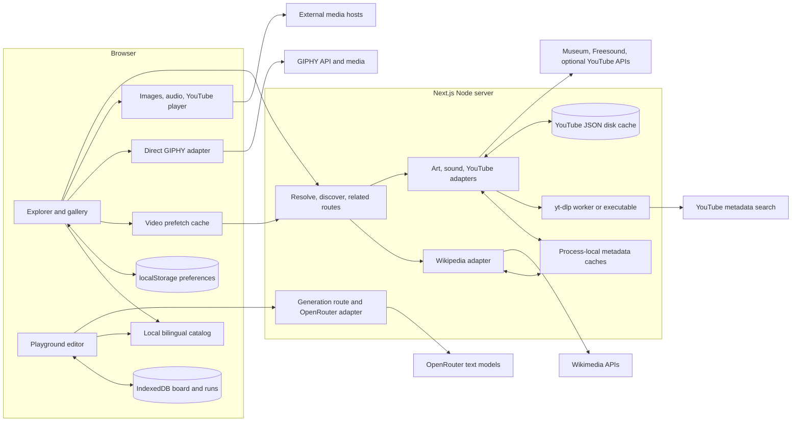
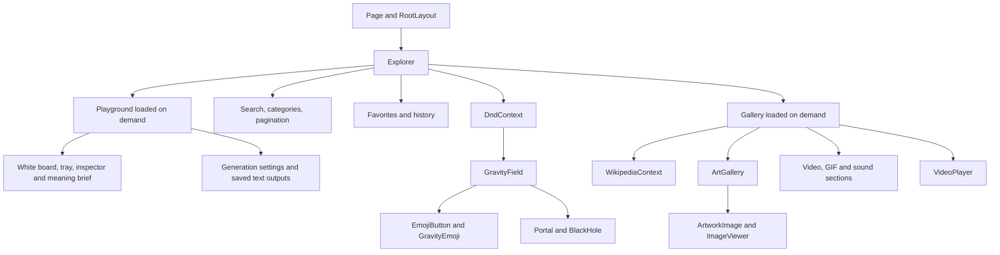
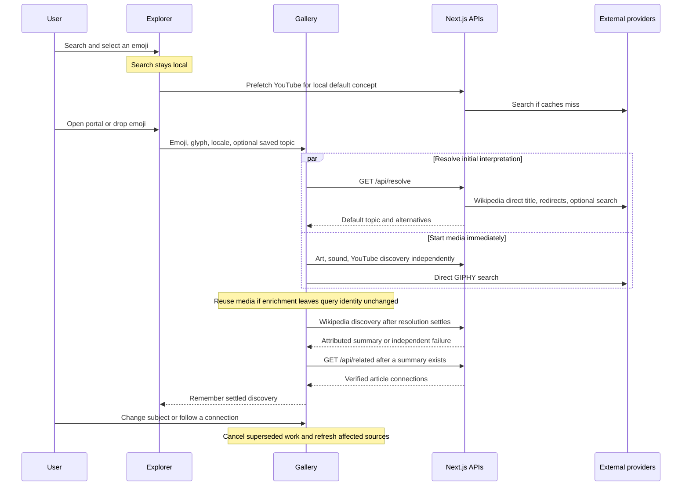
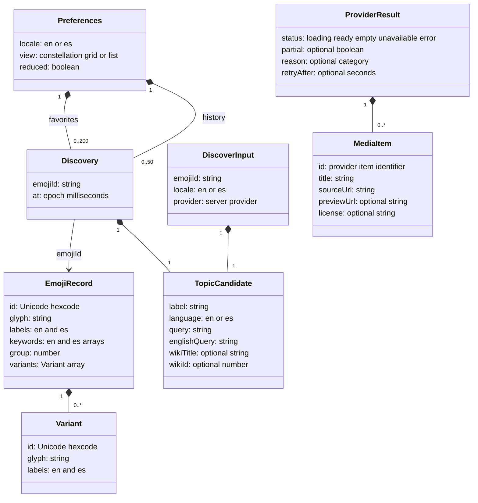
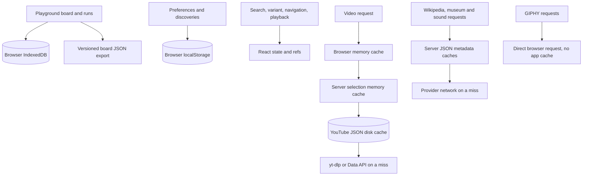
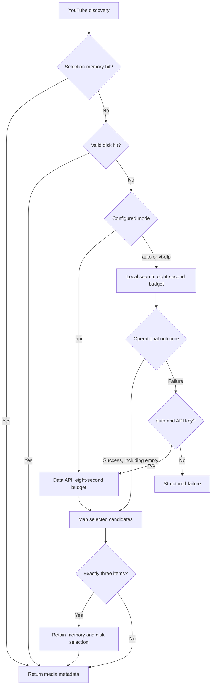

# Dream Maker: current architecture

Analysis date: October 2, 2026. Explorer baseline: commit `6e4ecf5`, updated to include the first Playground MVP. This document describes the checked-out implementation. Proposed changes are in [Future improvements and playground plan](future-improvements.md).

## 1. What the system does

Dream Maker is a personal English/Spanish emoji explorer. A user finds an emoji, chooses an interpretation, and opens a multimedia discovery containing Wikipedia context, museum artwork, educational videos, GIFs, and sound previews. They can correct the interpretation, follow related articles, and revisit favorites or history.

The architecture is a **single Next.js application with an interactive React client and server-side provider adapters**. The Discover canvas is an animated constellation and portal for browsing. A separate Playground section stores editable emoji compositions locally in IndexedDB and offers optional OpenRouter text generation. There is no account system, shared project store or durable server job database.

The important domain chain is:

**Emoji → chosen concept → provider-specific search → curated media → discovery.**

Concepts are editable starting interpretations, not universal definitions of emojis. For example, ❤️ initially means Love, with Human heart offered separately. Playground preserves this distinction through editable meanings for each emoji instance.

## 2. System boundaries

The page and root layout are Server Components. `Explorer` and the interactive components are Client Components. Client Components can contribute server-rendered HTML, then hydrate in the browser; “client” does not mean there is no initial server rendering. Browser storage, pointer input, playback, and request effects run after hydration.

Provider adapters that handle private credentials, filesystem access, and subprocesses are marked `server-only`. GIPHY is the deliberate exception: its integration key is public and requests run directly in the browser. Media bytes usually travel from the provider to the browser, rather than through the application server. The server retrieves and normalizes metadata; the yt-dlp integration does not download videos.

Relevant implementation: [page](../src/app/page.tsx), [layout](../src/app/layout.tsx), [Explorer](../src/components/Explorer.tsx), [provider dispatch](../src/lib/providers.ts), [GIPHY](../src/lib/giphy.ts).

## 3. Frameworks and runtime

Versions below are installed in this checkout, not claims about the latest upstream release. `package.json` uses compatible version ranges; `package-lock.json` records the dependency resolution.

| Technology | Installed version | Role |
| --- | --- | --- |
| Next.js | 16.3.8 | App Router, rendering, route handlers, development and production server |
| React / React DOM | 19.3.0 | Components, hooks, rendering and hydration |
| TypeScript | 5.9.3 | Strict static typing; `@/*` resolves to `src/*` |
| dnd-kit core | 6.3.1 | Pointer/keyboard dragging, drop detection and drag overlays |
| Motion | 12.43.0 | Gallery transitions and presence animation |
| Emojibase data | 17.0.0 | English/Spanish catalog labels, keywords, categories and variants |
| Cheerio | 1.2.0 | Wikipedia HTML extraction and provider text cleanup |
| Lucide React | 0.468.0 | UI icons |
| Vitest | 5.0.3 | Unit and integration checks |
| Playwright | 1.63.0 | Chromium interaction tests and visual review scripts |
| Node.js | README requires 20.19+; recommends 24 | Next.js server, streams, disk cache and child processes |
| Python 3 / yt-dlp | Optional external runtime/tool | Reusable metadata search workers; executable fallback also supported |
| CSS, SVG and Web Animations API | Browser primitives | Responsive styling, orbital motion, lensing and accretion animation |

There is no Tailwind, ORM, global state library, graph editor, vector database, job queue, or AI SDK in the dependency list. Google Fonts are loaded by CSS with system fallbacks. Most application state uses React hooks; gravity visuals use a focused React context.

`package.json` still reports version `0.1.0`, while the repository documents a `v0.2.0` release. Release tags and package metadata are currently separate version signals.

## 4. Main components and ownership

| Component/module | Responsibilities and boundaries |
| --- | --- |
| `Explorer.tsx` | Preferences, active tab, bilingual search, selected emoji/variant, pagination, drag/drop, gallery lifecycle, favorite/history callbacks, video prefetch |
| `features/playground/Playground.tsx` | Independent dnd-kit editor, searchable/sortable tray, selection/meaning/role/note/variant editing, explicit relationships, brief editing and generation runs; stays mounted after first opening |
| `features/playground/model.ts` | Renderer-independent version 1 composition schema, validated imports, reducer history and pure semantic compiler; coordinates excluded from text identity |
| `features/playground/storage.ts` | IndexedDB board/run persistence; validates recovered boards and run snapshots; interrupted runs recover as unknown |
| `features/generation/server/openrouter.ts` | Server-only text generator contract and fixed OpenRouter chat-completions adapter, timeout, safe errors and usage metadata |
| `Gallery.tsx` | Chosen topic, alternatives, correction search, 20-step back trail, independent provider states, request cancellation, retries and coordinated playback |
| `WikipediaContext.tsx` | Excerpt, attribution, visible English fallback, retry countdown and separate related-topic request |
| `ArtGallery.tsx` | Up to five works, match explanations, source attribution, partial recovery and image-viewer selection |
| `ArtworkImage.tsx` | Preview/full-image loading and fallbacks |
| `ImageViewer.tsx` | Native modal, browse, pointer-centered wheel zoom, up to 4× zoom, drag panning and focus restoration |
| `VideoPlayer.tsx` / `youtube-player.ts` | Native modal, user-triggered autoplay, lazy YouTube iframe API, playback/fullscreen shortcuts and player cleanup |
| `GravityLens.tsx` | Drag geometry, smoothed proximity/energy state, sliced SVG glyph distortion and directional echoes |
| `BlackHole.tsx` | SVG disk/light rendering and continuous animation playback-rate adjustment |
| `catalog.ts`, `concepts.ts`, `aliases.ts` | Searchable catalog and editorial starting interpretations |
| Provider/selector modules | Retrieve external candidates, screen metadata, rank, deduplicate and return common media results |
| `storage.ts`, `metadata-cache.ts`, video-cache modules | User preferences and independent transient/cache lifecycles |

The gallery is dynamically imported and also prepared when an emoji is selected. Components inside `Gallery.tsx` include preview cards, source links, video cards, sound cards and media sections; these are not independent files.

### Catalog and interaction

The catalog combines compact English and Spanish Emojibase data by Unicode hexcode. Records without a category and group 2 records are omitted. Skin variants are nested under the base emoji. Nine category controls are displayed.

Search is local, accent-insensitive and bilingual regardless of the UI language. Exact glyph/label matches rank first, followed by exact keywords, prefixes, and matches covering all query terms. A lazily constructed normalized search index avoids repeating normalization on every keystroke. Empty-query results interleave categories with a preferred browsing order. The UI debounces for 150 ms and displays 48 records per page.

Constellation positions are derived from the current page: three lanes, category sectors, and CSS orbital motion. These positions are not persisted user coordinates. Pointer dragging activates after six pixels; keyboard dragging uses dnd-kit. Enter selects an emoji; the Open portal action provides a non-drag path. Dropping on the portal opens the same discovery. System or application reduced-motion preferences disable continuous movement/distortion.

### Playground composition and generation

The whole board is one named scene. `Canvas.tsx` keeps camera, pointer gestures, selection affordances and fullscreen separate from the composition document. Catalog objects use the locally bundled Noto Color Emoji 2.051 COLRv1 font, matching the original system bitmap font’s artwork and gradients. Native font shaping preserves skin tones, flags and ZWJ sequences. The world layer changes its layout dimensions with zoom and only translates; the font renders its vector outlines at the displayed font size rather than enlarging a compositor bitmap. The font-face color-COLRv1 capability guard allows unsupported browsers to retain system emoji instead of rendering monochrome outlines. Unknown imported glyphs also retain the system-text fallback. A non-passive wheel handler zooms around the cursor; background pointer capture pans freely. Existing objects use pointer capture with a six-pixel drag threshold and commit only on release, while dnd-kit owns tray additions. Screen drops convert through the inverse camera; the floating picker and its overlay live inside the fullscreen element. A native fullscreen request falls back to a fixed viewport on unsupported hosts, with focus containment and scroll restoration. Selected glyphs glow/float (respecting both reduced-motion settings), and their delete affordance stays at screen size. Camera changes never enter undo history or semantic identity. Base catalog IDs and per-instance UUIDs are distinct. Positions are finite percentage coordinates in a world plane, allowed outside the initial 0–100 rectangle (capped at ±100,000 to keep imports finite), while glyph, meaning, role, note and explicit directed relationships supply a semantic brief. Custom interpretation text can override the readable preview without erasing structured entities. The pure reducer retains up to 50 undo entries; drag movement commits only on completion. Browser storage is independent of explorer preferences and retains the active board plus the last ten immutable generation inputs and editable outputs. Imports/exports contain boards, not generation runs or credentials.

Generation snapshots the current board and settings before sending. The server validates the request, enforces a configured model allowlist, deduplicates request IDs for 30 minutes in one process, and calls OpenRouter once. The adapter supports short messages, poems, stories, lyrics, image prompts and storyboards, all as text, with optional explicit reasoning effort. It records the actual model, token usage and cost when available. Changed authored meanings or relationships flag old outputs; position-only changes do not. No automatic retry, durable job store or restart reconciliation is provided. The UI checks configuration without calling the provider; key validity is established only on a deliberate generation.

## 5. Discovery data flow

Saved discoveries supply their topic immediately and skip initial topic resolution. They still request provider results, potentially served by caches. New discoveries start with local mappings and resolve Wikipedia independently; this avoids making all media wait for external subject resolution.

Media identity is based on locale plus normalized query/English query. Article identity also considers topic language and Wikipedia title. Adding a Wikipedia ID or description alone does not necessarily restart media searches. Each provider owns an `AbortController`; the gallery checks both cancellation and current-controller identity before accepting results. Navigation cancels changed work, pauses playback, updates the trail, and keeps unchanged results.

The shell opens before results finish, and sections reveal independently. Within an art or sound section, candidate searches are collected with `Promise.allSettled`; the section returns after those searches settle within their budgets. This is progressive loading across sections, not a streaming transport for individual media items.

## 6. HTTP interfaces and deadlines

| Interface | Request and result | Bounds |
| --- | --- | --- |
| `GET /api/generations` | Server configuration status and allowed model IDs; no key | Uncached, configuration check only |
| `POST /api/generations` | Board snapshot, settings and request UUID; returns text result/usage or safe error | 512,000-byte streamed-body limit; 80 nodes/160 relationships; configurable completion budget (default 8,192, including reasoning); provider timeout 120 s; 2 active and 6 new requests/min per process |
| `GET /api/resolve` | `emojiId`, `locale`, optional `q`; returns `Resolution` | Known base emoji; en/es; correction text ≤150 characters; server deadline 4.8 s, client 5 s |
| `POST /api/discover` | `DiscoverInput`; returns one `ProviderResult` | 8,192-byte body including streamed-byte enforcement; known emoji, locale, provider, validated topic |
| `GET /api/related` | `title`, `locale`; returns `RelatedResult` | Title ≤200 characters, no pipe separator, en/es; server 6 s, client 6.5 s |

Successful API responses explicitly use `Cache-Control: no-store`. Internal caches are application-managed rather than Next.js response caching. Invalid requests return 400; oversized discovery bodies return 413. Provider failures generally return a structured result with HTTP 200, so a monitoring system must inspect `status` and `reason`, not only the HTTP status.

Non-video discovery has a 7.8-second server deadline and eight-second gallery deadline. YouTube can spend eight seconds on yt-dlp and a further eight on optional API fallback, within a 17-second route deadline; browser prefetch uses 17.5 seconds and the gallery wrapper 18 seconds. These are failure ceilings, not latency targets. Other inner bounds include 2.2-second Wikipedia fetches, 5.5 seconds per sound search, 6.5 seconds for museums, and two seconds per Met object detail request.

API files: [resolve](../src/app/api/resolve/route.ts), [discover](../src/app/api/discover/route.ts), [related](../src/app/api/related/route.ts). Shared validation currently lives in [storage](../src/lib/storage.ts) and [bounded text](../src/lib/bounded-text.ts).

## 7. Domain and storage models

### Logical domain model

The following diagram describes TypeScript objects and their relationships; it is not a database schema.

`TopicCandidate` also supports a suggested flag and description. `MediaItem` is a broad common envelope: it can carry embed/image URLs, creator, date, collection, matching term, duration, excerpt, revision, language and sound connection. Fields are optional because an article, GIF, artwork and audio preview need different metadata. Media IDs are provider-scoped; museum IDs already include `cleveland:` or `met:` prefixes, but not all providers namespace their IDs.

`Resolution` contains a default topic and alternative candidates. The resolver returns up to four alternatives; the gallery validates and displays up to three. `RelatedResult` has its own ready/empty/error status and up to six topics. A sound connection is explicitly marked `direct` or `evocative`.

Definitions: [types](../src/lib/types.ts).

### Where data lives

| Store | Data and identity | Lifetime and limits | Durability |
| --- | --- | --- | --- |
| Bundled catalog/editorial tables | Emojibase JSON, aliases, concept mappings, sound/art/GIF associations, educational channel IDs | Loaded with code; changes require a code/data update | Repository and installed packages |
| Browser `localStorage` | JSON under `dream-maker-v1`: locale, view, reduced motion, favorites, history | 200 favorites; last 50 unique discoveries | Browser profile and origin only; no sync or backup |
| Browser IndexedDB | `dream-maker-playground-v1`, `workspace/active`: version 1 board and generation runs | 80 emoji instances, 160 relationships, last 10 runs | Browser origin only; explicit board JSON export/import |
| Server submission map | Request UUID and exact input fingerprint; in-flight/resolved outcome | 30 minutes, up to 100 entries; no eviction of live entries before the deadline | Process memory only; no restart/multi-instance guarantees |
| React state/refs | Search, selected variant, open gallery, provider results, trail, active playback, gravity | Current component/tab lifetime; trail capped at 20 | Lost on reload |
| Browser video cache | Complete `ProviderResult` selections keyed by locale/query/English query | One hour; 256 values; shared in-flight requests | Memory only |
| Shared provider JSON cache | Museum, Freesound and YouTube Data API responses keyed by URL plus headers | One hour; 256 values for that cache instance | Server-process memory |
| Wikipedia cache | JSON/HTML payloads keyed by request URL | One hour; 256 values | Server-process memory |
| yt-dlp search cache | Candidate arrays keyed by executable setting, query and locale | One hour; 256 values; includes successful empty/partial candidate pools | Server-process memory |
| Final YouTube selection cache | Provider configuration, concept identity and ranking version | One hour; 256 values; only selections of three retained | Server-process memory |
| YouTube disk cache | JSON `{at, items}` in `.cache/youtube`, or configured directory; SHA-256 key filenames | One hour; complete three-item selections only; cap 256 files; reader rejects files over 32 KiB | Survives process restart if local disk survives |

The 256-entry cap applies **per cache instance**, not to the whole application. The cache evicts the oldest inserted value at capacity; cache hits do not promote entries, so it is not a full LRU policy. TTL expiration is checked on access. Disk pruning happens after writes, so expired files may remain physically present until later pruning even though reads reject them.

### Persistence behavior worth preserving

`Discovery` stores the **base emoji ID, topic snapshot and timestamp**, not downloaded media or the current skin variant. Favorite/history identity is `emojiId:topicLanguage:wikiId-or-wikiTitle-or-normalizedLabel`. Revisits move to the front and deduplicate; different interpretations of the same emoji can coexist. Language differences can create separate identities for the same conceptual subject.

Reads validate catalog IDs, timestamps and topic fields; malformed entries are removed, bounds are enforced, and corrupt JSON/storage exceptions fall back safely. Writes report failure through the UI. Topic labels and queries are limited to 150 characters, optional wiki titles to 200, and descriptions to 2,000; arbitrary optional topic field types cannot reach the UI unchecked.

Saved topics are snapshots, while media lookups are refreshed or reused from metadata caches. Favorites are therefore not a permanent capture of a gallery. A cleared browser profile loses preferences and saved discoveries. Changing host/port can also change the origin and make the same local data unavailable.

`MetadataCache` shares identical in-flight work using subscriber counts. One caller leaving does not cancel another caller's request; only the last departing subscriber aborts the loader. Failures are not stored as values. Final/browser YouTube caches additionally reject incomplete selections for retention, while lower-level successful JSON/search responses can still be cached. A retry can recover a failed pool but may reuse successful lower-level candidates for an hour.

Disk writes use a temporary file plus rename and restrictive file permissions. Raw queries, API keys and configuration are not written into disk payloads or names: they participate in the hashed key. Some process-memory keys include authentication headers/configuration, which makes raw cache-key logging inappropriate.

Sources: [preferences](../src/lib/storage.ts), [metadata cache](../src/lib/metadata-cache.ts), [browser videos](../src/lib/video-prefetch.ts), [disk cache](../src/lib/video-disk-cache.ts), [selection cache](../src/lib/youtube.ts).

## 8. Provider adapters and selection

| Provider | Retrieval | Selection and output | Important boundary |
| --- | --- | --- | --- |
| Wikipedia | Action API titles/redirects, TextExtracts, English language links; search and REST fallbacks; related links from introduction/See also HTML | Up to four opening sentences and 150 words; excludes disambiguation; article/revision/license links; visibly labeled English fallback | Excerpts are source text, not generated explanations; related articles are actual verified links |
| Art | Cleveland and The Met in parallel; up to three English association queries | CC0/public-domain checks, trusted image hosts, metadata relevance, painting preference, artist/series diversity; up to five works | English canonical subject drives retrieval even with Spanish UI; partial museum failure can preserve results |
| YouTube | Two educational yt-dlp searches of up to 20 listings each; additional English search for sparse Spanish results; optional Data API searches/details | Topic/teaching evidence, duration 90–5,400 seconds, restriction/spam/explicit AI filters, channel-ID preference and diversity; up to three lessons | Flat listings omit some metadata; selection cannot prove embedding permission, factual correctness or undisclosed AI production |
| Freesound | Up to three scene searches, 30 candidates per scene, token auth | Verified CC0/CC BY, 0.3–180 seconds, title/tag/description relevance, diversity and audio deduplication; up to three previews | Literal versus evocative connections are labeled; unknown topics use precise subject search |
| GIPHY | Direct browser search, 25 candidates, G rating, selected locale | Metadata relevance from description/title/slug, narrow equivalents, duplicate/still filtering; up to three GIFs | No app cache/proxy; existing custom ranking conflicts with standard integration guidance |

The artwork code is current evidence: Cleveland retrieves images with metadata; The Met collects at most 24 unique IDs and hydrates them using four continuously refilled request slots. Cleveland verifies a preview's longest dimension is at least 600 pixels. Museum images load in the browser; larger-image failure can fall back to the preview.

Wikipedia uncached requests are serialized per process and paced at least 350 ms apart at start. A 429/503 sets a provider cooldown using `Retry-After`; cached results remain available. This avoids hammering alternate endpoints during a pause. It can also become a throughput bottleneck under many concurrent users.

YouTube `auto` mode falls back to the Data API after an **operational failure**, not simply after a successful empty search. `yt-dlp` mode never uses the API; `api` mode bypasses yt-dlp and requires its key. Richer API metadata supports stronger restrictions checks than flat search listings.

The optimized local transport uses a pool of at most two Python workers. Each imports the official yt-dlp archive once, keeps locale-specific clients, and exchanges newline-delimited JSON over stdin/stdout. Idle workers expire after five minutes; aborted/broken workers are killed and replaced. Without the archive setting, the app starts an executable per search, also limited to two concurrent processes. Both paths use argument arrays with `shell: false`, a reduced environment, bounded output and cancellation. Python script/tool files must remain available in the deployed runtime.

The exact relevance rules are deterministic editorial heuristics. They are a good explainable baseline but do not inspect every image, listen to every sound, or watch every video. Changed subjects rebuild the relevant search plan rather than retaining the original emoji association.

Sources: [Wikipedia](../src/lib/wikipedia.ts), [art](../src/lib/art.ts), [art selector](../src/lib/art-selection.ts), [sound retrieval](../src/lib/freesound.ts), [sound associations](../src/lib/sound-associations.ts), [sound selector](../src/lib/sound-selection.ts), [YouTube selector](../src/lib/youtube-selection.ts), [yt-dlp](../src/lib/ytdlp.ts), [worker](../src/lib/ytdlp-worker.ts), [process transport](../src/lib/ytdlp-process.ts), [GIF selector](../src/lib/gif-selection.ts).

GIPHY's current guidance disallows custom reordering/filtering and unapproved persistence/proxying. This affects both the current selector and any future canvas reuse/export; see the [provider's integration guidance](https://developers.giphy.com/docs/api/). A separate GIF section already avoids mixing providers in one result grid, but that does not resolve the custom-selection issue.

## 9. Operations, configuration and verification

The intended runtime is a local Node server bound to `127.0.0.1` for development and production startup. Wikipedia and museums require no keys; Wikimedia identification is configured by `WIKIMEDIA_USER_AGENT`. Optional variables choose YouTube mode/tool/cache paths and server-private YouTube/Freesound credentials. `NEXT_PUBLIC_GIPHY_API_KEY` is intentionally shipped to the browser.

The runtime requires network access to provider APIs and media hosts. YouTube local search additionally needs an executable or Python archive. A Node/container host fits the existing subprocess/disk behavior better than an edge runtime. A static-only export would not provide these API routes. No deployment manifest, hosted database, CI workflow, authentication, general discovery admission/rate limiter or shared queue was found in the tracked project files reviewed.

Security measures already present include bounded input/output, fixed provider endpoints, topic validation, `server-only` imports, external HTTPS URL screening, museum-host allowlists, no shell interpolation for searches, and no forwarding of private provider credentials into worker environments. Global headers set `nosniff`, a strict referrer policy, and disable camera/microphone/geolocation. A content security policy is not configured. These observations describe boundaries; they are not a penetration-test result.

Provider timing/status logs use structured `console.info` fields such as provider, duration, status and reason. Raw subject queries are omitted from those application logs. There is no dedicated metrics/tracing system. Bodies and outbound provider fetches are explicitly uncached at the HTTP layer; custom metadata caches handle permitted reuse.

### Checks performed for this analysis

| Check | Result |
| --- | --- |
| `npm test` | 149 tests passed across 16 files |
| `npm run typecheck` | Passed, including Next.js route type generation |
| Fresh browser suite / production build | Not rerun for this documentation-only analysis |
| Fresh live provider audit | Not performed; no credential values were inspected |

The existing [v0.2.0 release snapshot](releases/v0.2.0.md) records 30 passing Chromium checks plus prior build/live-review evidence. Browser source contains 28 named `test` calls, with parameterization contributing additional cases. Tests intercept provider requests, so they establish interaction/error behavior rather than live external relevance or availability. Vitest covers search, persistence, selectors, provider boundaries, bounded streams, caches, partial recovery and subprocess/worker lifecycle.

Review scripts under `scripts/` cover public content metadata, Wikipedia, sounds, yt-dlp latency and museum-image screenshots. They require a running app and, where relevant, configured credentials/tools. Most metadata reports go to `/tmp`; the art screenshot script writes into `docs/art-review/`. Existing reports are historical evidence and sometimes describe earlier implementations. For example, `emoji-app-spec.md` still names Chicago/three works, while current code uses Cleveland/The Met/five; older image-viewer notes say 2×, while current code permits 4×. Current source takes precedence when describing behavior.

## 10. Architectural assessment

The current design suits a personal explorer: little infrastructure, clear source attribution, deterministic selection, bounded persistence, and independent provider recovery. The gallery avoids a single global loading gate; the caches share work without letting one subscriber cancel another; the visual geometry is separated from drag hit-testing.

The main expansion pressure is that the domain currently represents **one selected topic at a time**. Playground now supplies repeated instances, authored meanings, labeled edges, one named scene, saved board state and text outputs. Multiple boards, ordered scenes, rendered media assets, durable jobs and cross-tab/cloud conflict handling remain future work. Other pressure points are the large stateful `Explorer`/`Gallery` components, overlapping topic/validation concerns in the storage module, broad optional media fields, process-local rate limits/caches, and the need to distinguish cache data from durable creative work.

The [future plan](future-improvements.md) develops those boundaries without requiring a rewrite of the existing explorer.
