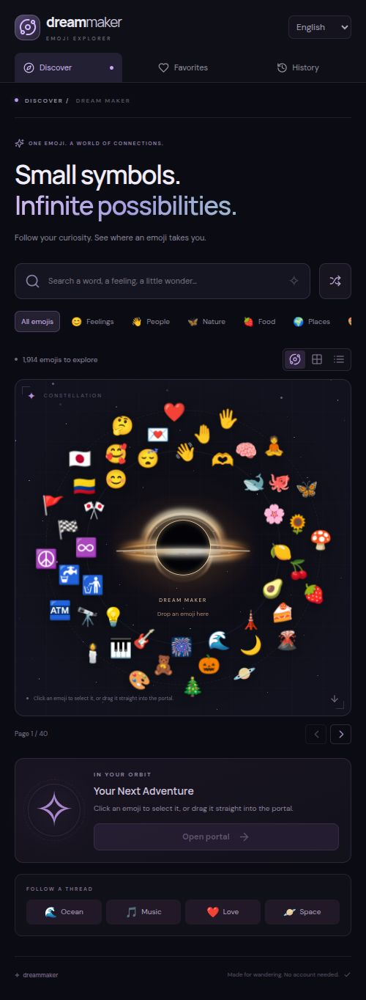

# Content and interaction review

Reviewed on October 1, 2026. This review concerns the local personal MVP, not a guarantee of provider availability or relevance.

## Method and live-source limits

Queried 21 real catalog subjects through the running application and manually reviewed the chosen subjects, alternatives, available Wikipedia prose, and artwork titles/metadata. Also inspected the real octopus gallery in the browser. The review script is `scripts/review-content.mjs`; it uses public Wikipedia and Art Institute endpoints, not sample media. Its temporary raw output is not required to run the app.

In the final batch, Wikipedia returned usable excerpts for 9 subjects and temporary unavailable responses for 12. Art returned results for 17 subjects and empty results for 4. These counts describe that run only. Repeated Wikipedia requests encountered HTTP 403/429 responses; isolated later requests succeeded. Requests are paced, successful metadata is cached, and affected sections have independent retry controls. Configure an identifying Wikimedia user agent before extended use.

YouTube, GIPHY, and Freesound keys were not supplied. Their missing-key states and adapter behavior were verified with isolated test responses; live coverage for those sources remains unverified. No unrelated sample media replaces unavailable sources.

## Subjects reviewed

“Limited” below means the batch could not retrieve Wikipedia context, rather than that no article exists. Artwork examples are returned titles; relevance can be thematic, and images should be evaluated before reuse.

| Emoji | Subject | Wikipedia in batch | Artwork observation and decision |
|---|---|---|---|
| 🐙 | Octopus | Ready | *Octopus and Shell*; clear literal match. Real gallery inspected. |
| 🦋 | Butterfly | Ready | Two *Butterfly* works and a cabinet with butterfly metadata. |
| 🐋 | Whale | Ready | Whale-decorated vessel, Jonah print, and marine bowl; meaningful subject matches. |
| 🦊 | Fox | Ready | *The Dancing Fox* and *Lion, Dragon and Fox*. Removed a Fox River place-name result. |
| 🍓 | Strawberry | Limited | Strawberry still life, textile design, and a strawberry seller print. |
| 🍋 | Lemon | Limited | Still lifes including lemons; broader composition titles remain attributable. |
| 🌙 | Crescent | Limited | Crescent headdress, crescent-moon dish, and Virgin on a crescent. Clarified the initial subject alias. |
| 🪐 | Planetary ring | Limited | Empty. Replaced the emoji label “ringed planet” with a more searchable literal concept. |
| 🗼 | Tokyo Tower | Limited | Empty. Paris remains a visibly labeled association, never the tower’s identity. |
| 🗽 | Statue of Liberty | Limited | Empty after excluding an incorrectly tagged papal medal. |
| 🌋 | Volcano | Limited | Eruption landscapes and Vesuvius imagery; literal geology theme. |
| 🎨 | Painting | Limited | Paintings returned for the broad art-form topic, including *The Bedroom*. |
| 🏃 | Running | Limited | Includes a running horse and a heroine running; animal activity is broader than the person emoji. Change subject can narrow the interpretation. |
| 🔭 | Telescope | Limited | *Melancholia* appears through subject metadata. A thematic association, not a promise of a telescope photograph. |
| 🧠 | Brain | Limited | *Brains* print; artistic/symbolic treatment rather than anatomy. |
| 😂 | Laughter | Limited | Expression drawings and a work titled *Laughter*. |
| 😴 | Sleep | Ready | Sleeping Rinaldo, infant faun, and woman; sensible interpretations. |
| ❤️ | Love | Ready | Love/Cupid themes. Human heart is a separate explicit interpretation even while offline. |
| ♾️ | Infinity | Ready | Symbolic prints with infinity in their titles. Two holdings have the same title but distinct collection identifiers. |
| 🇨🇴 | Flag of Colombia | Ready | Empty. Flag aliases preserve the country and full Unicode sequence. |
| 🎵 | Music, then Musical note | Ready | Broad “Music” tags produced weak associations. Narrowed the default to *Musical note* / *Nota musical*: the individual recheck returned the correct Wikipedia excerpt and empty art. Music remains a search keyword. |

## Changes made from the review

- Added or clarified literal subject aliases for crescent, planetary rings, country flags, and musical notes. Spanish octopus context uses the verified article title *Octopoda* while the picker retains the everyday label *pulpo*.
- Excluded the two verified incorrect/homonym artwork results; no replacement media was invented.
- Kept uncertain article suggestions explicit. Exact titles or redirects are required for automatic article selection; users can select alternatives or search for a correction.
- Verified Spanish language-link responses are arrays and corrected their adapter. English subject labels now follow the selected Spanish article when available, instead of silently keeping the original emoji’s subject after a correction. See the [MediaWiki REST reference](https://www.mediawiki.org/wiki/API:REST_API/Reference/en#Get_languages).
- Preserved empty, credentials, quota/unavailable, network, and timeout states separately.

## Verification

Final delivery checks: **29 unit tests passed; 8 browser tests passed against the production server; TypeScript validation and the production build passed.** A separate live Spanish octopus check returned *Octopoda* context in Spanish with *Octopus* as its English media query. The English anatomical-heart endpoint also returned the full *Heart* article rather than a redirect stub.

The subsequent orbital-canvas update passed **29 unit checks and 9 browser checks**, including actual movement, upright glyphs, double-size hover, pause/resume, drag-and-drop, and reduced-motion behavior. The interface now uses a golden vector black hole with lensed light and gentle shimmer.

The drag-position correction passed **10 browser checks**. Its regression check reproduced the original jump, then verified preservation of an off-center grab point at four orbital positions, both at activation and while moving to the portal. Emoji and portal measurements now include their actual positioning transforms.

- Unit coverage: bilingual/accent search, flags and compound sequences, variants, deterministic positions, persistence corruption/limits, Wikipedia prose extraction and attribution, Spanish language mapping, provider rights filters, GIPHY order/direct fresh retrieval, request validation, and unavailable-source states.
- Browser coverage: search and keyboard reveal, pointer drag, favorites/history across reload, stale subject cancellation, corrupt storage, pagination/variants, Spanish phone layout, reduced motion, modal focus, requested playback and cleanup, and repeated hydration.
- Production build and TypeScript validation are part of the delivery checks. Browser tests use fixtures to exercise behavior reliably and do not establish real provider coverage.

## Remaining limits

Museum metadata can contain broad themes or errors beyond the two reviewed exclusions. Abstract subjects can surface symbolic works, and some subjects have no suitable collection images. Wikipedia rate limits and external quotas remain outside the app’s control. Optional media adapters need the user’s credentials and a live smoke test after setup. Generated media, combinations, accounts, public hosting, and Jev classification remain outside this MVP.
