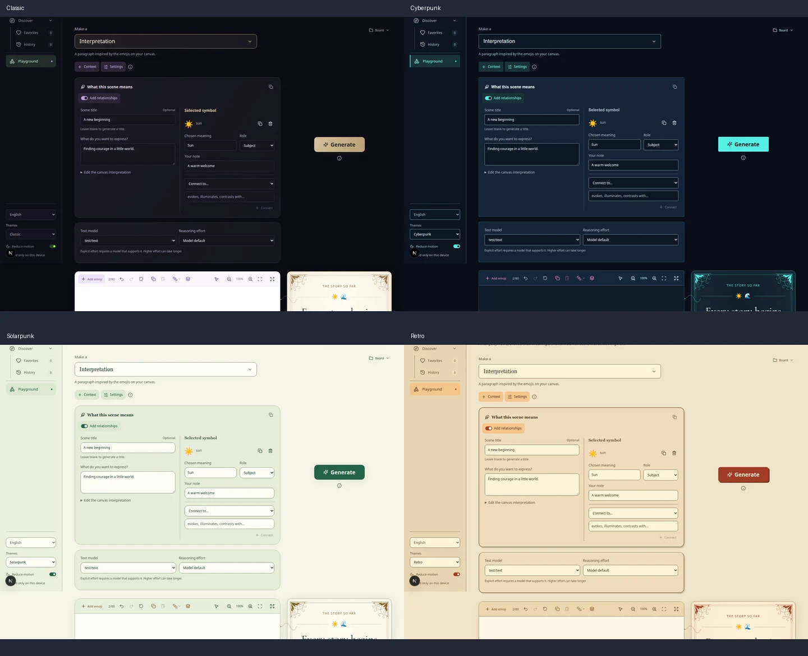

# Context and Settings controls

The header now exposes **Context** / **Contexto** and **Settings** / **Ajustes**.

Context is one enclosing panel. Its scene fields and **Add relationships** toggle
are inside it. Enabling relationships shows the selected-symbol editor, custom
meanings, notes, roles, variants and connection controls within that panel.
Desktop uses adjacent columns; narrow screens stack the editor below the fields.
The toggle and every field retain their state when Context is collapsed or when
the user switches to another in-app tab.

Settings contains only model, reasoning effort and their explanatory line. The
adjacent information icon contains completion limits, output-format information,
data-submission information, connection status/retry and the existing local-copy
action. It opens on hover, focus or tap; a short pointer grace period supports
moving into the content. Escape and outside interaction dismiss it. Its scrollbar
is inside a clipped shell, and the panel fits both desktop and phone viewports.

The active canvas, current result and temporary UI state start fresh after a page
refresh. Saved story-shelf creations, including their immutable inputs and edited
text, remain stored. Preferences, language and theme remain saved. An exported
board can be imported to resume a composition.

Browser coverage checks Context nesting, both relationship states, draft fields,
canvas zoom and result editing across hiding/tab switches, fresh reload state,
retained history, desktop/phone placement, all four themes, English/Spanish,
keyboard/touch access and connection retry. Axe checks cover the settings
information popover alongside the surrounding playground.

Validation: 217 unit tests and 90 browser scenarios passed across the relevant
playground, localization and theme suites (including reruns after updating the
previous reload expectations). The production build was also checked with 17
header and theme browser scenarios. TypeScript and the production build pass.

