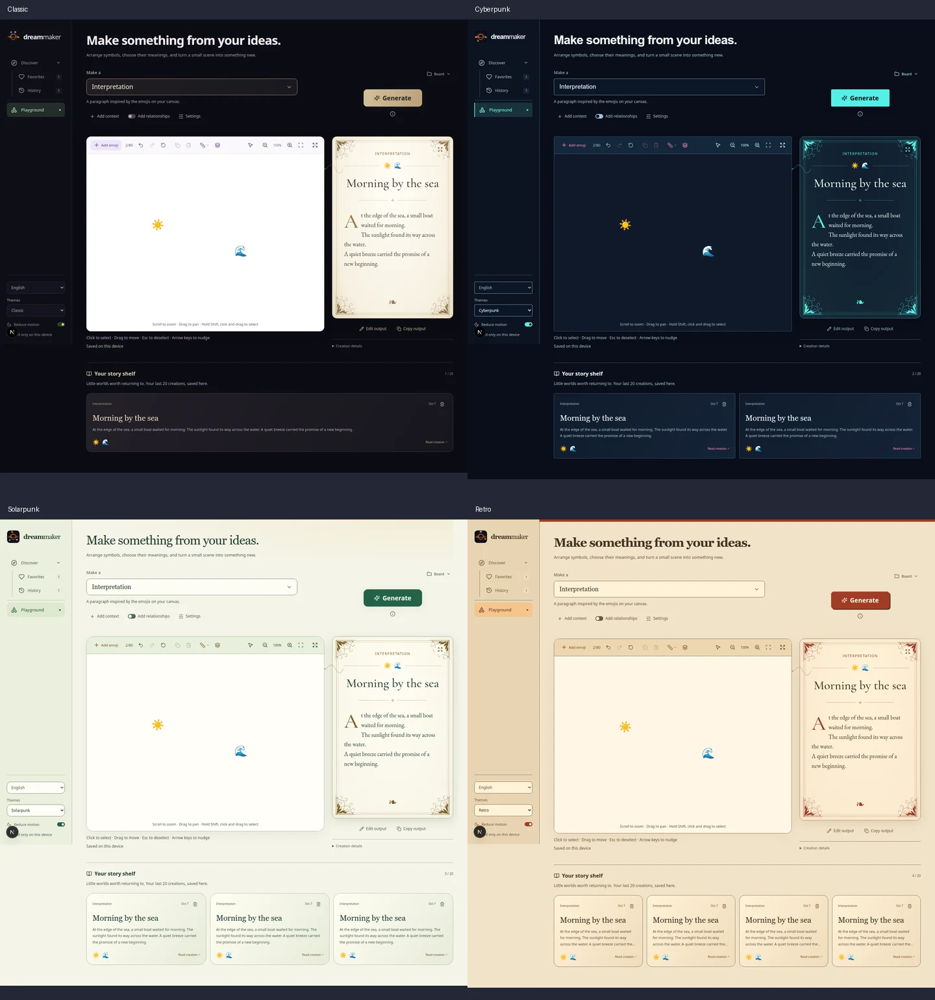
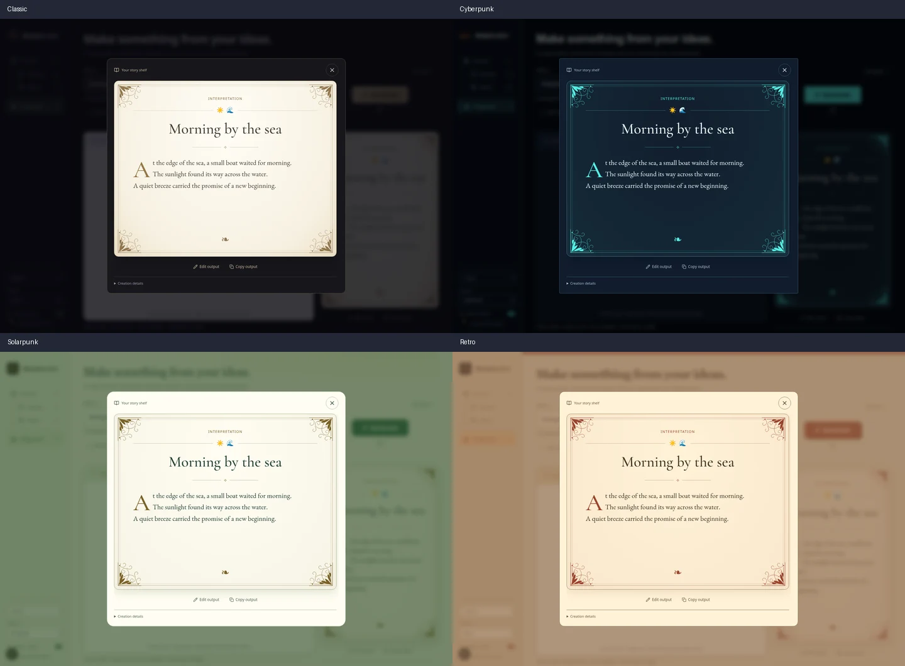
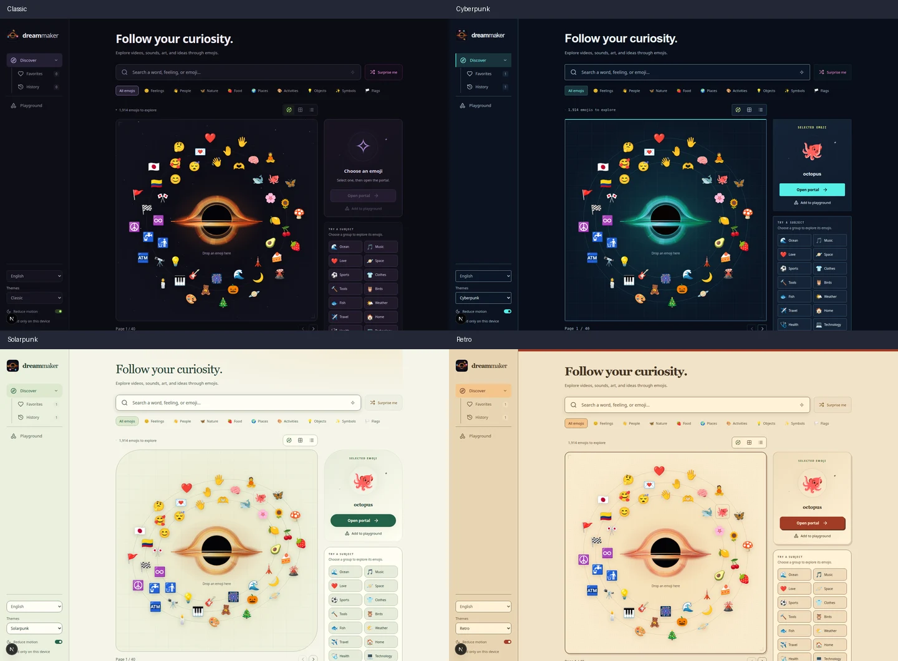
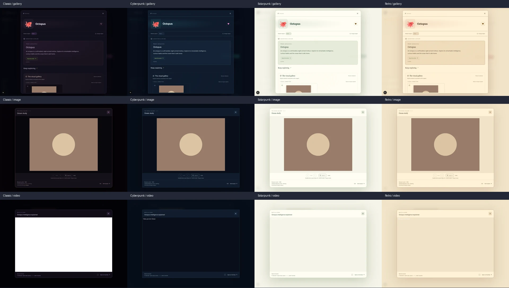

# Theme visual audit

Audited Classic, Cyberpunk, Solarpunk and Retro against the reported screenshots.
The result layout, ornamental geometry, history grid, black hole renderer and
orbit paths are preserved. Color changes now extend to the history reader and
result surfaces as requested in the follow-up.

## Reported defects

| Defect | Cause | Correction | Themes |
| --- | --- | --- | --- |
| Add relationships switch has no visible state | Palette overrides gave the track and knob the same surface color | Contrasting track/knob colors; pill track and circular knob; distinct on/off color and position | All new themes |
| Dark rectangle behind the story shelf | A preservation rule forced Classic background tokens | Transparent shelf context with themed cards, headings, dividers, delete/undo and expansion controls | All new themes |
| Black wedges around rounded result paper | The rectangular result wrapper had a dark background | Transparent wrapper and coordinated paper, border and shadow colors | Solarpunk and Retro; consistent treatment in Cyberpunk |
| Portal scrollbar crosses rounded edges | The modal shell itself scrolled | Clipped outer shell, inset inner scroller, fixed close header; topic navigation resets the inner scroller | All four |
| History reading view remains Classic | Its selectors were excluded from the general theme mapping | Explicit palette for the reader shell, paper, ornaments, text and actions; existing fonts, proportions and grid retained | All new themes |
| Playground canvas corners are discontinuous | Outer stage, toolbar and board used different radii, with a duplicate board border | Stage owns the border; toolbar and board use its inner corner radius and meet at a straight seam; fullscreen clears radii and border | All new themes; Classic verified |
| Reduce motion switch disappears | Track/knob colors collapsed together; disabled opacity made them faint | Distinct state colors, full-opacity device-controlled state, retained disabled semantics; preference also accessible on phones | All four, with themed colors in the new themes |

## Additional corrections

- Generate hover previously changed only its background to a panel color, leaving
  unreadable foreground text. Normal and hover states now retain the filled primary
  action, with contrasting text.
- Story shelf subtitles and creation details retained pale Classic text on light
  backgrounds. They now use the theme's readable muted color.
- Inputs, selectors and viewer controls have stronger interactive borders than
  decorative dividers. Search focus, keyboard focus and toolbar/menu hover states
  remain visible in each palette.
- Reader keyboard focus explicitly wraps between visible controls, including
  the editing textarea, after moving scrolling inside the modal shell.
- Scrollbar thumbs now contrast with their surfaces. Scroll tracks in rounded
  inspector and picker panels are inset away from the curved corners.
- Circular status indicators and switches retain their semantic shapes; the
  original logo and canvas emoji buttons retain their transparent backgrounds.
- Relationship lines and arrowheads now follow the selected palette.
- Mobile sidebar/preference borders honor their original layout resets.
- Repeated phone/desktop resizing previously multiplied incompatible width/height
  scale factors, progressively shrinking canvas artwork. Camera resizing now
  compares both viewports with a stable world rectangle, preserving size and
  center on round trips. Fullscreen restoration uses the same reference.

## Coverage

Visual review covers orbital discovery, grid discovery, Favorites, History,
Playground, selected-symbol/context/settings panels, emoji picker, fullscreen
canvas, portal gallery, image viewer, video viewer and history reader in all four
themes. Desktop screenshots use 1440 × 1000; phone review uses 390 × 844. Browser
regressions additionally cover 320, 768, 1024 and wider desktop layouts, English
and Spanish, keyboard interactions, long results, expanded/deleted history,
media playback, and device/user reduced-motion settings.

Borders were checked for consistent radius ownership, connected seams, visible
interaction states, viewport containment and scrollbars staying inside rounded
modal shells. Palette checks distinguish decorative lines from interactive
control boundaries. Actual story typography remains locally loaded; external
Google font requests are blocked in deterministic browser fixtures, exercising
the app's declared heading-font fallbacks as well.

Media screenshots use intercepted provider responses: a simple SVG artwork and
a placeholder video document, allowing the viewer chrome to be audited without
external playback or API credentials.

Axe checks cover discovery, the empty playground, populated story shelf, hovered
Generate action, long story reader, and portal gallery across the relevant
palettes. They run after opening transitions finish so contrast is measured in
the resting state. Focus restoration, Escape, modal closing and orbit/drag
behavior have separate interaction checks.

## Screenshot comparisons

### Playground and story shelf

### History reading views

### Discovery and preserved orbits

### Media modal surfaces

## Validation

The camera unit test verifies repeated aspect-ratio round trips. Theme browser
checks verify both switch states, continuous canvas borders, themed result
accessibility, modal scroll containment, preserved reading layout, unchanged
black hole geometry, upright emoji artwork on all orbit lanes and camera size
restoration. An older header assertion was updated to the existing generated
creation-title behavior already covered by the story tests; the entered scene
title remains verified in the request snapshot.

| Check | Result |
| --- | --- |
| Unit tests | 217 passed across 25 files |
| Complete Chromium suite | 127 scenarios verified: 124 passed in the full run; the reader-focus correction and two trace-artifact collisions passed their targeted reruns |
| Final optimized-build browser checks | 14 passed, including all theme checks, reader typography, reduced motion, focus containment and persisted editing |
| Type checking | Passed |
| Production build | Passed |
| Diff whitespace check | Passed |

The two trace-artifact collisions occurred when development and production runs
shared a temporary output folder; their output folders were separated. The
reader's Shift+Tab issue was corrected in the implementation and regression
checked in every theme at desktop and phone widths.
