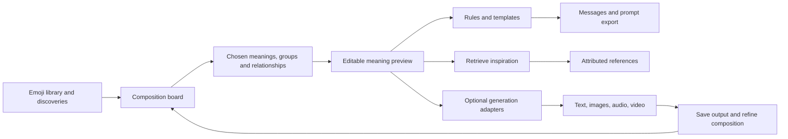
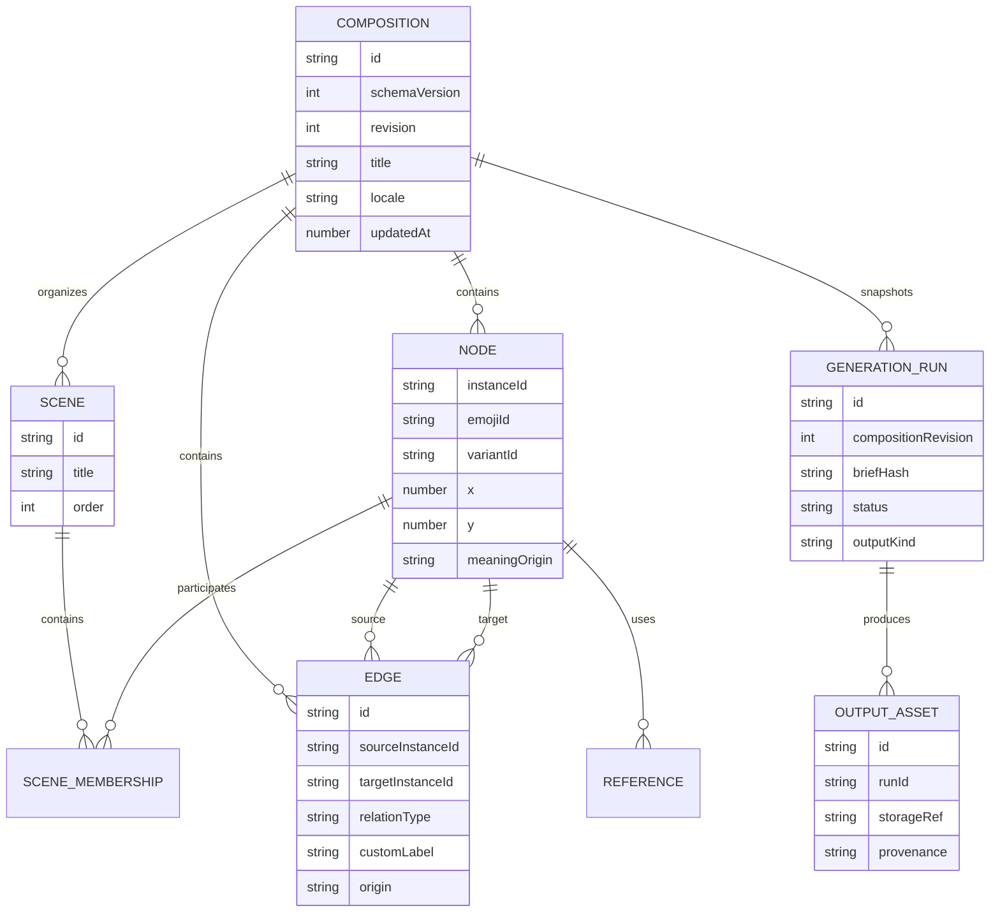
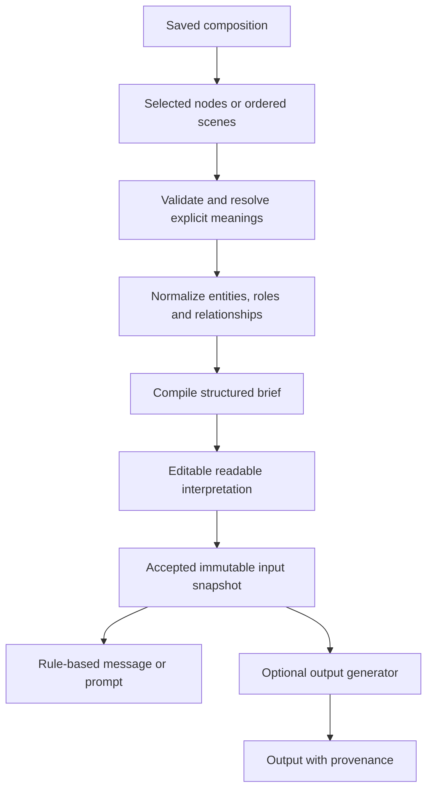
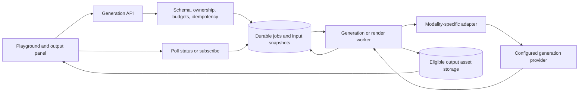

# Dream Maker: future improvements and playground plan

Planning date: October 2, 2026. This document was written as a proposal. The first Playground MVP is now implemented: a fourth sidebar section, white canvas with wheel zoom, free panning, fullscreen focus, object and group resize/rotation, area selection with group dragging/deletion, and a floating clickable/draggable emoji picker, bilingual search/filter/sorting, instance meaning/note/role/variant editing, labeled relationships, a single named scene, undo/redo, IndexedDB autosave, JSON import/export and an editable brief. OpenRouter generates messages, poems, stories, lyrics, image prompts and storyboards as text, with local run snapshots and bounded single-process submission controls. See the [setup and limits](../README.md#use-the-playground). Multiple boards/scenes, durable jobs and rendered media remain future milestones. The [current architecture](architecture-overview.md) describes the existing system.

## 1. Recommended direction

Build the playground as a **local, editable composition graph**, then let several output mechanisms consume the same composition. The product becomes:

**Discover symbols → arrange ideas → state relationships → preview meaning → create an output → refine.**

The first milestone should let someone arrange emojis, choose what each means, connect/group them, save the board, and produce a useful message with deterministic rules. Text generation can follow. Image, sound and video generation should be separate capabilities added when the composition model is working.

This order tests the distinctive idea—whether arranging emojis helps people express something—before committing to expensive media pipelines. The current catalog, bilingual concepts and discovery services are useful building blocks. Existing provider results are inspiration/retrieval; they are not generated assets.

### Example of the intended experience

A user places 🌙, 🌊 and ❤️ in a group called “A quiet evening.” They choose Moon, Ocean and Love as meanings. They connect Moon → Ocean with “illuminates,” and Love → group with “sets the mood.” They select “gentle, Spanish, short message.”

The meaning preview says: “A moonlit ocean scene with an affectionate, calm mood.” A rule-based message might be “Una noche junto al mar, bajo la luna, contigo.” An optional generator can propose variations. Later, the same accepted brief can become an image prompt, a soundscape plan, or a three-scene storyboard.

The preview is an editable interpretation. It must not claim that the symbols objectively imply that sentence. The user can reinterpret ❤️ as anatomy or 🌙 as nighttime rather than the physical Moon.



## 2. What the initial playground includes

| Area | Initial behavior | Why it matters |
| --- | --- | --- |
| Entry point | A Playground destination alongside Discover/Favorites/History; “Add to playground” on a selection or discovery | Discovery remains useful; concepts can flow into a composition |
| Emoji tray | Existing bilingual search/categories; drag or click to add | Reuses catalog logic and provides a touch/keyboard path |
| Board | Place, select, move, duplicate and remove instances; pan/zoom; reset viewport | Repeated emojis and spatial arrangements express different things |
| Inspector | Chosen concept, note, role, optional intensity; subject correction | Meaning belongs to this instance, not the global emoji definition |
| Relationships | Connect selected instances with labels such as with, contrasts with, causes, before, evokes | Stores intentional associations rather than guessing from coordinates |
| Groups/scenes | Name a group; choose an explicit scene order | Gives context and a later bridge to storyboards |
| Meaning preview | Selected nodes/scenes compiled to an editable structured brief and readable text | Makes the interpretation inspectable before creation |
| Save/recovery | Local autosave, saved boards, duplicate, JSON export/import, undo/redo | Creative work must survive more than a UI session |
| First outputs | Emoji sequence, deterministic message, copied prompt/brief | Delivers value without credentials or generation costs |

Keep the first relationship vocabulary small. Let users rename a relationship; internally retain a stable type plus custom label. Cycles can be meaningful in an association graph; reject only invalid endpoints/self-links where inappropriate. A later generation workflow can be acyclic without forcing the creative graph to be a DAG.

Proximity can offer a “group these” suggestion on drag completion, but it should not silently create a semantic edge. Node size/rotation should be treated as appearance unless the user explicitly assigns intensity or another semantic field. A row of nodes must not imply narrative order unless the user enables that convention or orders a scene/sequence.

The board should use ordinary selection and editing motion. Reuse the app's visual identity, but avoid continuously orbiting user-authored nodes: stable positions are important when composing. A future “send composition through the portal” animation can remain decorative.

## 3. Rendering and state-management choices

### Recommended initial editor

Start with a short implementation spike using **React Flow (`@xyflow/react`)**. Its React node/edge model is a close fit for explicit relationships, custom emoji nodes and pan/zoom. The official docs describe node/edge state and custom components; existing dnd-kit can still handle the emoji tray. This is a recommendation based on the proposed product, not an installed dependency. See [React Flow quick start](https://reactflow.dev/learn).

The palette-to-board bridge must convert screen coordinates into board coordinates and avoid competing drag ownership: use one owner for adding from the tray and the editor's own handling for moving existing nodes. Verify keyboard addition, touch, focus and announcements. React Flow documents accessibility support and external drag/drop; native HTML drag/drop alone is insufficient for the desired touch flow. See [accessibility](https://reactflow.dev/learn/advanced-use/accessibility) and [drag/drop examples](https://reactflow.dev/examples/interaction/drag-and-drop).

| Option | Best fit | Tradeoff for this project |
| --- | --- | --- |
| React Flow | Connected concept graph with custom React nodes | Smallest path to relationships/viewports; still requires document persistence, semantic rules, history and touch QA |
| Custom DOM/SVG + current dnd-kit | Small, bounded emoji board with few connections | No graph dependency, but selection, zoom coordinates, edge routing and editing must be built |
| Drawing-oriented editor | Freehand sketches, shapes and rich whiteboard tools become the core product | Broader surface/model than the first emoji composition needs; evaluate licensing and extension APIs before selection |
| Canvas/WebGL scene renderer | Very large scenes, custom effects or timeline playback dominate | More work for accessible editing, hit-testing and text; useful later as an output renderer |

A product “canvas” need not be an HTML `<canvas>`. Keep the stored composition independent of rendering technology so a React/SVG editor can feed a later raster/video renderer. Use a reducer and focused context initially; add an external state store only if measured update/subscription pressure warrants it. Keep pointer/hover/viewport state separate from the semantic document.

## 4. Proposed composition/storage model

The most important change is introducing an **instance ID distinct from the catalog emoji ID**. Two instances of ❤️ may have different positions, interpretations and relationships.



This is a proposed logical schema, not a requirement to create relational tables for the first release. An IndexedDB composition record can initially contain nodes, edges and scenes as one versioned document.

| Model | Suggested fields beyond the diagram |
| --- | --- |
| Composition | Created/updated timestamps, schema version, content revision, document locale, user intent, style/tone, scene order; editor viewport saved separately or explicitly excluded from content identity |
| Node | Base catalog ID, selected variant ID/glyph, chosen `TopicCandidate` snapshot, role, optional intensity, user note, position and display style |
| Meaning | Origin: catalog/editorial, Wikipedia-resolved, user-authored or model-suggested; optional source language/page/revision; accepted flag for suggestions |
| Edge | Stable endpoints, relation type, custom label, directed flag, origin/acceptance; optional strength only if its meaning is defined |
| Scene/group | ID, name, ordered member IDs, scene order and later duration; geometry and membership are separate |
| Reference | Provider plus item ID, source URL, permitted metadata, attribution/license, retrieval time and intended use; persistence policy depends on provider |
| Generation run | Immutable input snapshot, normalized brief/hash, compiler/template version, adapter/provider/model version, output settings, status, timestamps, error category and cost/usage when available |
| Output asset | Run link, kind/MIME, inline text or durable blob/object reference, dimensions/duration, origin and rights/provenance |

Catalog IDs preserve Unicode sequences; store the variant explicitly so creative appearance is not lost as it currently is in favorites. Topic snapshots preserve the author's chosen meaning even if editorial mappings change. An unknown future catalog ID should remain visible with its saved glyph/label and a repair action, rather than destroying the entire composition on load.

Validate imports: schema version, finite coordinates, size/node limits, valid relation types, unique IDs and endpoint integrity. A JSON import is data; do not render notes as HTML or fetch arbitrary embedded URLs. Apply migrations before editing and retain a recovery copy when a migration fails. Preserve catalog and custom meanings independently.

### Persistence progression

Keep existing preferences/favorites in their current localStorage key. Store compositions, local run records and eligible output blobs in **IndexedDB**, which supports larger structured records, transactions and blobs asynchronously. This fits growing boards better than rewriting a large synchronous localStorage JSON value on every move. See [IndexedDB documentation](https://developer.mozilla.org/en-US/docs/Web/API/IndexedDB_API).

Use a small `CompositionRepository` interface (`list`, `get`, `save`, `delete`, `export`, `import`) with an IndexedDB implementation. Autosave committed edits after a short debounce, flush drag-end actions, show saved/unsaved/failure status, and offer explicit export. Browser data remains subject to quota and eviction; persistence requests are not backups. See [storage quotas and eviction](https://developer.mozilla.org/en-US/docs/Web/API/Storage_API/Storage_quotas_and_eviction_criteria).

Undo/redo should record semantic commands: add/remove node, move node, set meaning, add relation, group, edit scene. Collapse a whole drag into one undo entry. Hover and animation frames are not edits. Content revision changes when creative input changes; viewport panning alone should not invalidate a generated result. Use a revision check to detect conflicting saves from another tab.

Add accounts/cloud sync only when users need shared links or multi-device work. At that point, a relational metadata store plus blob/object storage is a reasonable direction: project ownership/revisions in the database, large generated assets in object storage. Preserve the repository interface and local export so local use continues to work. Collaboration/conflict resolution is a separate milestone.

## 5. Turning a board into meaning

The composition compiler should be a pure, testable layer. Its output is a structured `CompositionBrief` plus readable preview. It should use selected concepts, accepted relationships, scene order, roles, mood, language and user intent. It should not serialize a screenshot as the only input.



The brief should retain entity IDs as well as text so an output can explain which symbols contributed. Use a canonical ordering and compiler version for reproducibility. A semantic hash should include accepted meanings, relationships, scene order, intent and output-relevant settings; exclude cosmetic coordinates unless the chosen output explicitly uses spatial layout.

For an initial no-AI path, support a few honest templates such as greeting, short scene description and story premise. When a board has no well-defined template, export the emoji sequence and structured prompt rather than forcing a fluent but misleading interpretation. Unknown/custom notes remain user text.

A model can later suggest themes, labels or alternative interpretations, but should return schema-validated proposals tied to actual node IDs. Show suggestions and let users accept them. Do not overwrite chosen meanings because a model inferred another association. Wikipedia excerpts remain labeled source text; generated descriptions receive their own label and provenance.

## 6. Output mechanisms: start small, keep them independent

| Output | First useful implementation | Later enhancement | Main dependency |
| --- | --- | --- | --- |
| Message | Emoji sequence and a few localized templates; editable text | Optional text model with tone/length/language controls | Good semantic brief and user editing |
| Image | Export a composition using emoji/text/SVG, or copy an image prompt | Generate a new image from the accepted brief | Dedicated image adapter and provenance |
| Sound | User-triggered playback of owned/authorized clips or synthesized ambience | Generative audio; optional narration/speech | Audio graph/timing model, usable rights and fetch permissions |
| Video | Ordered storyboard and simple animated emoji scenes | Rendered scenes, narration, transitions, generated clips | Scene timing, durable jobs, storage and render pipeline |
| Other | Poem, greeting card, learning prompt, recipe for a scene | Interactive story, quiz, accessible description or reusable template | Output-specific constraints, not a new board model |

**Text should be the first AI capability.** It is the fastest way to see whether a composition communicates intent and whether users can improve it. Keep a provider-neutral `GeneratorAdapter` capability contract; initially implement only one configured text backend rather than pretending all modalities share one API. Return text and usage metadata, and keep editing/copy available when generation fails.

Existing discovery can provide references at the user's request, preferably for a selected node/group rather than every node on every move. Reuse topic resolution and search planning. If a combined concept lacks a direct article, show individual concepts and an authored scene brief; do not invent a Wikipedia article for the combination.

For audio without a generative model, Web Audio provides routing, mixing, gain and scheduling, and can support synthesized ambience or approved clips. The current sound-preview UI deliberately pauses other previews, so a soundscape needs a separate mixer/playback controller. Remote previews may not support fetching/decoding, CORS, or output reuse; validate those before treating discovery results as mixer inputs. See [Web Audio documentation](https://developer.mozilla.org/en-US/docs/Web/API/Web_Audio_API).

For video, begin with a storyboard export and an owned emoji-scene renderer. This can create value without a video model. Choose rendering/encoding tooling only after specifying duration, frame size, formats and host constraints; do not reuse metadata-only yt-dlp workers as render workers. Later generation can supply clips/images/narration as assets in the same scene timeline.

### Asset handling is a new boundary

Displaying an external work, exporting it, remixing it and sending it as model input are different uses. Add capability flags such as display-only, reference-link, may-fetch, may-export and may-use-as-input, derived from verified provider/content rules. Do not equate a source URL with ownership or reuse permission.

Keep GIPHY as a direct, separate browsing integration until its existing selection/persistence issue is resolved. Do not place its media URLs or GIF blobs in saved boards or send them into generation by default. Retain only permitted reference information; where durable references are not permitted, keep them session-local or omit them. Current provider guidance also restricts mixing its results with other providers in one grid. See [GIPHY integration guidance](https://developers.giphy.com/docs/api/).

Museum CC0 works and properly attributed CC BY sounds are promising candidates for eligible reference workflows, but retrieval permissions and delivery support still need to be represented. Source, creator and license metadata should travel with a reference and its exported attribution. For YouTube, default to links/embeds; the current adapter retrieves metadata, not editable video files.

Browser image export has a separate technical constraint: cross-origin images without suitable CORS permission can taint a canvas and prevent readback/export. Emoji/text-only export is a simpler first step; asset-aware export must check supported sources and report unsupported ones. See [cross-origin images in a canvas](https://developer.mozilla.org/en-US/docs/Web/HTML/How_to/CORS_enabled_image).

## 7. Generation lifecycle and proposed backend

Interactive retrieval and durable generation have different semantics. Closing a gallery should cancel unneeded discovery; closing a generation panel should not lose a paid, long-running output.

For the first local text experiment, a bounded server request can be sufficient. Save the input/run locally before submitting, distinguish a disconnected response from a known provider failure, and avoid automatic resubmission. If a request is interrupted, mark the run's outcome unknown until reconciled. Add a durable backend before promising restart recovery, shared use or long-running media.

For that durable stage, propose the following interfaces, separate from the existing `/api/discover`:

| Proposed interface | Purpose |
| --- | --- |
| `POST /api/generations` | Validate an immutable brief and settings, enforce limits, deduplicate by idempotency key, persist a job and return 202 plus job ID |
| `GET /api/generations/{id}` | Retrieve authorized status, output references, cost/usage and actionable failure |
| `POST /api/generations/{id}/cancel` | Request best-effort cancellation and reconcile with provider state |
| `GET /api/generations/{id}/events` | Optional progress events; polling is sufficient initially |



This diagram is a later-stage target. The MVP does not require deploying a queue, account service and cloud storage on day one. A local worker with a durable job store may suffice for a single-user experiment; a multi-user service requires per-owner access controls and appropriate shared infrastructure.

Use a job state machine: queued → running → succeeded / failed, with cancel-requested and cancelled represented separately. Provider cancellation may be unsupported or may arrive after completion. Recover stale running jobs after a restart; reconcile external job IDs before charging for a retry. Preserve successful assets even if the board later changes.

Store the exact submitted input snapshot and composition revision. If the user edits while a result is running, attach the result to that snapshot and visibly say the board has changed. Do not let an old result overwrite newer notes or meanings. Undoing a board edit must not resubmit a generation.

Use a unique idempotency key per deliberate submission, stable across transport retries. Two requests with the same key must not create two paid jobs. Reuse of the same semantic brief can be offered separately as “reuse previous result”; random creative variations remain intentional distinct runs with their settings/seed when supported. Do not use the current one-hour metadata cache as the job or asset store.

Before paid generation, show the selected output scope, settings and an available cost estimate or configured cap. Enforce server-side per-run/concurrency limits, bounded retries and cancellation. Keep generation secrets on the server, and retain an auditable status/usage record without logging raw creative content by default. Imported notes/provider text should be treated as untrusted content and cannot instruct a generator to execute tools or fetch arbitrary URLs.

## 8. Proposed integration boundaries

Keep the explorer and its APIs functioning while adding a composition feature. A useful future organization would be:

```text
src/features/playground/
  components/          Board, tray, inspector, meaning preview, output panel
  model/               Composition types, validation, migrations, commands
  storage/             Repository contract and IndexedDB implementation
  compiler/            Semantic brief, deterministic templates, serialization
src/features/generation/
  model/               Run, job and output asset contracts
  server/              Provider adapters, job submission and reconciliation
src/app/api/generations/
  ...                  New route handlers when server generation is introduced
```

This tree is a proposed organization, not files added by this report. Read the installed Next.js guides before implementing routes or changing the client/server boundary, as required by the project's `AGENTS.md`.

Shared concepts need a small extraction first: make topic validation a domain module rather than importing it from preferences storage; give reusable discovery orchestration a hook/service boundary; make concept resolution available to a node inspector without opening a full gallery. Use provider-plus-ID identities for cross-provider references.

Keep the composition model free of editor-library objects. Translate between document nodes/edges and React Flow objects at a boundary; otherwise changing renderers becomes a storage migration. Keep generated output models separate from `MediaItem`, whose optional fields currently serve ephemeral discovery.

## 9. Delivery roadmap and acceptance criteria

Milestones describe scope and dependencies rather than calendar commitments. The next development step should be the interaction/persistence spike, followed by a small usable composition editor.

| Milestone | Scope | Acceptance gate |
| --- | --- | --- |
| A. Editor spike | Custom emoji nodes, tray drag/click add, coordinate conversion, pan/zoom, touch/keyboard paths | Dragging works at multiple zoom levels; catalog ID and instance ID stay distinct; no conflict with portal drag handling |
| B. Local composition MVP | Nodes, explicit meanings/edges, one grouping/scene mechanism, reducer history, IndexedDB autosave, JSON import/export, template message | Repeated emoji instances retain distinct meanings/variants; reload restores board; undo returns a drag as one action; storage failure leaves export possible |
| C. Text generation | Meaning preview, editable intent/settings, one server adapter, run snapshot, result editing, budget/idempotency controls | Output uses the selected graph; old results cannot overwrite current work; duplicate submission is controlled; failures preserve authored board |
| D. Rich local outputs | Eligible references, emoji/image export, user-controlled sound experiment, ordered storyboard | Export attribution survives; unsupported/CORS-blocked assets are identified; independent mixer stops cleanly; scene order is explicit |
| E. Durable media generation | Durable job store, workers, modality adapters, output storage, cancellation/reconciliation | Reload/restart recovers status; retry avoids duplicate paid jobs; outputs retain input/provider provenance and accessible previews |
| F. Sharing and collaboration | Accounts, cloud sync, permissions, shared boards, conflict handling | Unauthorized access is blocked; offline edits reconcile; author/export provenance remains intact |

For a constrained first version, pick one group/scene mechanism, a small relationship vocabulary and message output. Broad freehand drawing, automatic graph interpretation, multi-user presence and video generation can wait until the central interaction is validated.

### Verification that matters

Add domain tests for instance identity, relation integrity, undo/redo, migrations, corrupted imports, semantic serialization and output scope. Test that changing a visual coordinate alone does not alter a non-spatial message brief, while changing a meaning does. If a spatial output intentionally consumes coordinates, test its separate identity rules.

Browser checks should cover drag placement at different zoom/scroll positions, keyboard add/connect/delete, touch alternatives, save/reload, same-emoji duplication, meaning correction, modal focus and reduced motion. Existing portal tests must continue to pass. Use fake generation adapters for timeout, late success, duplicate submission and cancellation races.

Evaluate real text outputs against bilingual human-reviewed examples: emotional ambiguity, literal anatomy, repeated symbols, abstract concepts, flags and conflicting relationships. Include an example such as Love → Human heart and verify the output changes accordingly. Judge preservation of the user's intended meanings, coherence, edit usefulness and cost—not just fluent prose.

Measure interaction responsiveness with modest and larger boards, committed-save latency, recovery success and template/generation usage. Select node limits and performance budgets from that evidence. Do not replace editorial retrieval with semantic models until a bilingual evaluation shows improvement over the current deterministic baseline.

## 10. Other improvements, prioritized

| Priority / timing | Improvement | Project-specific reason and first action |
| --- | --- | --- |
| Before extending shared domain code | Separate topic validation/identity from `storage.ts` | API and gallery currently import a preferences module; establish a reusable concept contract and distinguish localized topic identity from durable concept identity |
| Before exposing public endpoints | Provider policy and deployment readiness | Resolve current GIPHY custom filtering; add request admission limits; choose a host that supports or isolates yt-dlp processes and required files |
| With playground MVP | Saved-data export/import and migrations | Browser-only creative work needs portability and repair; preserve existing favorites and add versioned composition schemas |
| With any generated assets | Distinct reference/output/provenance models | Current `MediaItem` is a broad optional-field discovery envelope; durable assets need provider identity, ownership/use capability and source/run traceability |
| Near term | Refactor gallery orchestration into focused logic | Resolution, requests, trail, playback and UI share one component; extract cancellation-aware logic without changing behavior |
| Near term | Improve content curation feedback | “Wrong meaning / poor match” can capture local corrections and fixture candidates; review them before updating aliases rather than learning silently from every click |
| Near term | Consolidate documentation/version signals | Historical notes disagree on museums, artwork counts, zoom and setup; label historical reports, keep a current architecture index, align package version when releasing |
| Near term | CI checks | No checked-in workflow was found; automate lockfile install, tests, typecheck and build; browser fixtures remain deterministic |
| When generation/hosting grows | Diagnostics and observability | Add cache-hit/queue-time/provider-error metrics and request/run IDs; current console timings cannot explain distributed queues or paid job outcomes |
| When multiple users/instances exist | Shared provider scheduling and cache strategy | Wikipedia pacing and yt-dlp limits are process-local; multiple hosts multiply request pressure and duplicate work |
| When UI grows | Split styles and profile renders | Global CSS mixes large compact rules and later overrides; gravity context updates during drag could affect more consumers as the board expands |
| After core composition validation | Scene templates and personal meanings | Reusable greetings, mood boards, learning boards and user-owned concept overrides can improve authoring without a universal semantic claim |
| After output value is demonstrated | Optional cloud sync and collaboration | These require ownership, revision/conflict policy and storage lifecycle; they are not prerequisites for the local editor |

Additional product directions with a clear connection to the current explorer include guided learning journeys from saved article trails, collections organized by concept/theme, bilingual messaging, accessible verbal descriptions of boards, and personal association libraries. A discovery trail is currently ephemeral and limited to 20 steps; saving it as a named learning journey would be a distinct feature. Personal interpretations should augment editorial defaults rather than globally redefine emoji labels.

Semantic retrieval or AI relevance judging is another later experiment. The existing specification mentions Jev, but no Jev integration exists. Compare any candidate-based semantic method against the current English/Spanish fixtures and real-source reviews, keeping literal search, provider-policy constraints, source attribution and honest empty results. A vector database is unnecessary for the first playground and should not be introduced without a retrieval need.

## 11. Decisions to validate through use

The first prototype should answer whether people prefer arranging a mood/scene, writing a sequence, or connecting a concept graph. The proposed model supports all three, but the UI should emphasize the one that helps users most. Also validate how much explicit relationship editing is comfortable, whether outputs target personal expression or learning, and whether most users want authored media or fresh generation.

The initial planning assumptions are personal use, English/Spanish, local-first persistence and message output first. If public sharing or video is the primary first requirement, the ordering changes: ownership/job storage and an explicit scene/timing model move earlier. Those assumptions can be changed without discarding the separation between composition, interpretation and output.
