# Production deployment and CI/CD

This runbook deploys `main` to Ubuntu 24.04 amd64 at **https://dreammaker.hexloop.cc**. Caddy runs on the host; the router forwards HTTPS directly to it. The application runs as one non-root Node 24 process in Docker, with the existing SQLite accounts, preferences and creations on local persistent disk. Server setup is performed by the owner. Review and merge the CI/CD PR before using `main` below.

## Delivery model

```mermaid
flowchart LR
    PR[Pull request] --> CI[Typecheck, unit, browser, recovery and container checks]
    CI --> Review[Owner review and merge to main]
    Review --> Image[Publish tested image to GHCR]
    Image --> Poll[Ubuntu polls over outbound HTTPS]
    Poll --> Clone[Test migrations on isolated SQLite clone]
    Clone --> Gate[Caddy maintenance; drain and stop app]
    Gate --> Backup[Verified final SQLite backup]
    Backup --> Start[Start image; migrate and check readiness]
    Start --> Open[Commit deployment and reopen traffic]
```



`.github/workflows/ci.yml` runs on PRs, pushes to `main`, and manual dispatch. PRs never publish. The `CI` job is the required branch check. Verification covers Chromium UI tests, real authentication and SQLite in the production container, assets, yt-dlp, persistence across restart, and restoring an online backup. Controller tests exercise failed backups, failed migrations/readiness, power-loss journals, preservation of writes after traffic reopens, and rollback. Provider calls in tests are simulated; no production keys or live accounts enter CI.

Browser verification runs in parallel with unit/controller/image verification; the required `CI` job succeeds only when both pass. The workflow exports the tested image and publishes that exact artifact, rather than rebuilding it. Images use `sha-<40-character-commit>` and the moving `production` tag in `ghcr.io/juandarr/emoji-dream-maker`. The server resolves the tag to an immutable digest and records its Git revision and account schema. Main workflow runs are serialized and superseded commits are skipped before promotion. A manual run from another branch only verifies it.

The host polls once a minute using systemd. It requires outbound access to GHCR; it exposes no deployment endpoint and needs no inbound SSH from GitHub or self-hosted Actions runner. Caddy exposes 80/443; Docker publishes the app only on `127.0.0.1:3101` (container port 3000). Port 3000 is already occupied by another container on this server; that service is preserved. The Caddy example replaces client-supplied `X-Forwarded-For` with the directly connected client's IP. Revisit that configuration if a CDN or tunnel is introduced later.

## Files and persistent paths

| Path | Purpose |
| --- | --- |
| `Dockerfile`, `.dockerignore` | Standalone Next.js image; native SQLite; pinned Node base and verified yt-dlp archive; excludes private data |
| `deploy/compose.yaml` | One app container, UID/GID 10001, persistent mounts, graceful stop, bounded logs |
| `deploy/manage.py` | Serialized updates, clone preflight, backup validation, durable recovery journal and rollback |
| `deploy/Caddyfile.example` | Host site and filesystem maintenance gate |
| `/opt/dreammaker/app.env` | Root-owned production secrets/configuration, mode 0600 |
| `/opt/dreammaker/deployment.json` | Registry, public origin, host port and persistent path configuration |
| `/opt/dreammaker/state.json` | Current/previous immutable images, backups, pause/failure status and journal |
| `/opt/dreammaker/control/maintenance.flag` | Existence causes Caddy to return 503 with `Retry-After` |
| `/var/lib/dreammaker/accounts/accounts.sqlite` | Live database, including account credentials and durable attempts |
| `/var/cache/dreammaker/youtube` | Disposable video metadata cache |
| `/var/backups/dreammaker` | Verified backups and quarantined databases |

The data, cache and backup directories belong to UID/GID 10001 with mode 0700; database backups use 0600. Credentials, SQLite files and backups must never be committed or uploaded as release assets. Node/Python run inside the image; the host needs Python 3, Docker Engine with Compose **2.30 or newer** (raw env-file support), Git and Caddy. Host Node/npm are unnecessary.

## 1. Configure GitHub

1. Enable Actions for this repository and allow the pinned official checkout/setup-node/artifact actions. The publication job requests `packages: write` for its built-in `GITHUB_TOKEN`; no PAT or SSH secret is needed.
2. In **Settings → Rules → Rulesets** (or branch protection), target `main`: require a pull request, require **CI**, and require checks to pass on the latest branch state. Keep force pushes/deletion disabled. Owner review and manual merge are the approval point; an additional reviewer is optional for this personal repository. Avoid bypassing these rules for normal releases.
3. In **Settings → Secrets and variables → Actions → Variables**, optionally set `NEXT_PUBLIC_GIPHY_API_KEY`. This browser-visible Giphy key is built into the bundle; changing it requires another main build. Leave absent if GIF integration is unused. Private provider/auth keys belong only on Ubuntu.
4. Leave `PRODUCTION_URL` unset during bootstrap. After the first working server deployment, set it to `https://dreammaker.hexloop.cc`. Subsequent main runs verify that the public `/api/health` reports the exact deployed commit, allowing up to ten minutes for polling/update. A failed public verification marks the workflow failed; it does not rewind the database.
5. Merge the reviewed PR after **CI** succeeds. Wait for **Publish tested main image** to finish. On the GitHub **emoji-dream-maker** container package page, open **Package settings → Change visibility → Public**. New packages may initially be private. Public GHCR packages support anonymous pulls; source image contents contain no private configuration. Package visibility changes can be permanent: review GitHub's [package visibility documentation](https://docs.github.com/en/packages/learn-github-packages/configuring-a-packages-access-control-and-visibility) before this one-time change.

Confirm on Ubuntu, without registry credentials:

```sh
sudo docker pull ghcr.io/juandarr/emoji-dream-maker:production
```

Do not enable timers until the first deployment, transferred data and public access have been verified.

## 2. Prepare Ubuntu

First inspect the existing server; preserve its other services and Caddy sites:

```sh
lsb_release -ds
uname -m
sudo docker version
sudo docker compose version
caddy version
sudo systemctl status caddy --no-pager
sudo ss -ltnp 'sport = :3101'
df -h / /var
```

If Docker with Compose v2 is already installed and operational, skip installation. If absent, use Docker's [Ubuntu apt repository instructions](https://docs.docker.com/engine/install/ubuntu/). On a clean Ubuntu 24.04 amd64 host the repository setup is:

```sh
sudo apt-get update
sudo apt-get install ca-certificates curl git python3
sudo install -m 0755 -d /etc/apt/keyrings
sudo curl -fsSL https://download.docker.com/linux/ubuntu/gpg -o /etc/apt/keyrings/docker.asc
sudo chmod a+r /etc/apt/keyrings/docker.asc
sudo tee /etc/apt/sources.list.d/docker.sources >/dev/null <<'EOF'
Types: deb
URIs: https://download.docker.com/linux/ubuntu
Suites: noble
Components: stable
Architectures: amd64
Signed-By: /etc/apt/keyrings/docker.asc
EOF
sudo apt-get update
sudo apt-get install docker-ce docker-ce-cli containerd.io docker-buildx-plugin docker-compose-plugin
sudo systemctl enable --now docker
sudo docker run --rm hello-world
sudo docker compose version
```

If conflicting distro packages are installed, resolve them using Docker's instructions before installing; do not remove packages supporting other services blindly. Keep Docker commands under `sudo`. Port 3101 must be free. If needed, choose another unused port using `host_port` in `/opt/dreammaker/deployment.json` and update this app's Caddy upstream to match; container port 3000 stays fixed. Retain router forwarding to Caddy on 80/443, and ensure DNS points to this home connection. This runbook assumes Caddy already works on the host.

Clone the reviewed `main` branch into a new tools checkout (it never stores live data):

```sh
git clone --branch main https://github.com/juandarr/emoji-dream-maker.git "$HOME/dreammaker-deployment"
cd "$HOME/dreammaker-deployment"
git rev-parse HEAD
sudo python3 deploy/manage.py install
```

Installation creates directories, copies the controller/Compose examples and installs systemd units. It sets maintenance mode but **does not enable timers or change Caddy**. Paths are configured in `/opt/dreammaker/deployment.json`; the provided units/site expect `/opt/dreammaker`. Check disk space for at least two image versions, a database clone and retained backups; monitor available space as data grows.

## 3. Create private production configuration

```sh
sudo install -o root -g root -m 0600 /opt/dreammaker/app.env.example /opt/dreammaker/app.env
sudo nano /opt/dreammaker/app.env
```

Use the Docker env-file format (`NAME=value`, no `export`, no surrounding quotes, no shell expansion). Keep values single-line. Compose uses raw format to match the clone's Docker env-file parsing, including literal dollar signs in secrets. Preserve the **existing `BETTER_AUTH_SECRET` privately** while transferring the database. Set `BETTER_AUTH_URL=https://dreammaker.hexloop.cc`, a private production invitation phrase and a valid catalog ID such as `1F419` (🐙). Rotating the invitation does not deactivate existing accounts. The changed origin means users should sign in again on the production hostname; their preferences and creations remain attached to their existing account IDs. No password/email recovery flow exists.

Set a private OpenRouter key if generation is desired. `OPENROUTER_MODELS=openrouter/free` restricts the production selector to the free router. Free model availability and upstream limits can change; unavailable generation should not affect account storage. Freesound/YouTube keys are optional. Set a public contact in `WIKIMEDIA_USER_AGENT`, or omit it to use the app default. Compose sets the absolute container DB and cache paths. Never paste this file or secrets into chat or CI. If copying configuration between machines, use an authenticated private channel.

## 4. Export and transfer the existing database

On the machine holding the current database, in its app checkout with the existing ignored `.env.local`:

```sh
umask 077
mkdir -p "$HOME/dreammaker-transfer"
node --env-file=.env.local scripts/account-backup.mjs "$HOME/dreammaker-transfer/accounts.sqlite"
node scripts/account-check.mjs "$HOME/dreammaker-transfer/accounts.sqlite"
sha256sum "$HOME/dreammaker-transfer/accounts.sqlite"
```

Use the new `account-check.mjs` from this reviewed checkout if the current checkout predates it; Node/native dependencies must be installed there. The online backup captures committed WAL transactions consistently. Do not copy only a live SQLite main file. Record the checksum, counts and application migrations locally. For the final cutover, stop writes to the old service, then make this final export; otherwise writes after the snapshot will remain only on the old machine. Interrupted generation attempts become unknown on restart and are never automatically resubmitted.

Transfer the snapshot via SCP or another authenticated private method to your Ubuntu login account. Replace `ubuntu-user@server-lan-address` with your actual connection:

```sh
scp "$HOME/dreammaker-transfer/accounts.sqlite" ubuntu-user@server-lan-address:~/dreammaker-import.sqlite
```

On Ubuntu, before the first deployment only:

```sh
sha256sum "$HOME/dreammaker-import.sqlite"
sudo test ! -e /var/lib/dreammaker/accounts/accounts.sqlite && \
  sudo install -o 10001 -g 10001 -m 0600 "$HOME/dreammaker-import.sqlite" /var/lib/dreammaker/accounts/accounts.sqlite
sudo docker run --rm --network none \
  --mount type=bind,src=/var/lib/dreammaker/accounts,dst=/check \
  --entrypoint node ghcr.io/juandarr/emoji-dream-maker:production \
  scripts/account-check.mjs /check/accounts.sqlite
```

The conditional import refuses to run if a production file exists. **Stop if that command fails**: never overwrite an existing production file using the import command. Compare the transferred checksum and table counts with the source export. Keep the original export privately until cutover and restore testing succeed. Keep the original server stopped as a fallback to avoid diverging data.

## 5. Add the Caddy site

Back up the current Caddyfile, then add the site block from `/opt/dreammaker/Caddyfile.example` to the existing configuration. Preserve all other sites; if this hostname is already configured, replace only its site block. The maintenance matcher checks `/opt/dreammaker/control/maintenance.flag` on every request. Caddy must be able to traverse the root/control directories (installer sets 0755); it never needs access to the database or secrets.

```sh
sudo cp -a /etc/caddy/Caddyfile /etc/caddy/Caddyfile.before-dreammaker
sudo nano /etc/caddy/Caddyfile
sudo caddy validate --config /etc/caddy/Caddyfile --adapter caddyfile
sudo systemctl reload caddy
curl -i https://dreammaker.hexloop.cc/api/health
```

During installation this should return **503** and the maintenance message. Test from outside the LAN too; hairpin NAT/DNS can differ inside. Confirm that removing spoofable forwarded-IP headers works with the direct router connection. The controller also verifies that Caddy actually serves the exact 503 maintenance response over loopback HTTPS with this hostname's valid certificate before stopping the app or restoring/migrating the database. A missing/unloaded matcher blocks the update; repair Caddy and retry journal recovery. Caddy must listen on loopback as well as the public interface. Existing requests may finish after the maintenance flag closes; stopping the app allows a 150-second graceful drain, then the final backup is taken. The cloned preflight runs before maintenance to shorten the interruption.

## 6. First deployment and acceptance

```sh
sudo python3 /opt/dreammaker/manage.py update
sudo python3 /opt/dreammaker/manage.py status
curl --fail https://dreammaker.hexloop.cc/api/health
sudo docker inspect dreammaker-app --format '{{.State.Health.Status}}'
sudo docker exec dreammaker-app node scripts/account-check.mjs /data/accounts.sqlite
sudo docker port dreammaker-app
```

Confirm the health revision matches the published main commit and port mapping is **127.0.0.1:3101** (or your configured host port). In a browser, sign in with an existing account and inspect preferences, favorites and both creation collections. Check saved board restoration, a theme change, logout/login and optional providers. Your existing password should work. Verify unauthorized account APIs return 401 and no raw database files are publicly available.

Perform a verified backup and observe the daily schedule:

```sh
sudo python3 /opt/dreammaker/manage.py backup
sudo systemctl enable --now dreammaker-update.timer dreammaker-backup.timer
sudo systemctl list-timers 'dreammaker-*' --no-pager
```

Backups run at **08:00 UTC (03:00 America/Bogota)**; the timer is persistent, so a missed daily run executes after startup. Retention keeps the latest 14 daily and 7 predeployment snapshots, with the currently referenced backup protected. Failed restores quarantine all previous SQLite/WAL/SHM files together; quarantines are retained for explicit review and consume additional disk space. Backups stay local initially. A disk failure can destroy both data and local backups; add an encrypted copy to another destination later.

Set the GitHub `PRODUCTION_URL` variable only after these acceptance checks. The next approved PR merged into `main` should publish and deploy automatically; its publication job confirms the new revision at the public URL. Check the first routine deployment together before treating setup as complete.

## Updates and operation

Use PRs for improvements, wait for `CI`, review and merge. New images are built from main, while the persistent database and private config remain outside the image. Keep one container/process: SQLite and the durable generation coordinator are not configured for horizontal scaling. Short maintenance windows are expected.

```sh
sudo python3 /opt/dreammaker/manage.py status
sudo journalctl -u dreammaker-update.service -n 100 --no-pager
sudo journalctl -u dreammaker-backup.service -n 100 --no-pager
sudo docker logs --tail 100 dreammaker-app
sudo python3 /opt/dreammaker/manage.py pause
sudo python3 /opt/dreammaker/manage.py resume
```

`pause` stops new promotions; it does not close user traffic or stop backups. `resume` allows the next poll to deploy the current production digest. `retry` retries a failed digest after fixing configuration/storage; it also respects pause, so resume first. Registry outages leave the current service running. Clone/backup failures prevent migration. A failed candidate is blocked to prevent a maintenance loop until a new digest or explicit retry.

State and image selectors are written atomically with fsync, and update/backup/rollback use the same filesystem lock. On an interrupted update, the next update or backup command recovers its journal before proceeding. Before the durable `committed` state, recovery restores the final backup and previous image under maintenance. After `committed`, traffic may have reopened: recovery keeps the current database, retries the current image and pauses with maintenance active if it cannot become healthy. Inspect status/logs rather than deleting journal files or removing the maintenance flag manually.

If you change `/opt/dreammaker/app.env`, pause, edit privately, then restart the same app container without pulling/promoting another image:

```sh
sudo python3 /opt/dreammaker/manage.py pause
sudo docker compose --env-file /opt/dreammaker/image.env -f /opt/dreammaker/compose.yaml up -d --force-recreate app
curl --fail https://dreammaker.hexloop.cc/api/health
sudo python3 /opt/dreammaker/manage.py resume
```

This config-only restart causes a brief interruption; do it during a quiet period. If paths/port were customized, export matching `DREAMMAKER_DATA_DIR`/`DREAMMAKER_CACHE_DIR`/`DREAMMAKER_HOST_PORT` for Compose, or use the controller with an updated image rather than this default-path command. Do not rotate the auth secret as part of a routine config edit.

### Controller and dependency updates

Host `manage.py`, Compose/systemd units and Caddy are installed separately. Image promotion does **not** silently change root-owned host code. For a PR changing `deploy/`, pause updates first, review changes, update the tools checkout, then reinstall and validate/reload any Caddy changes manually:

```sh
sudo python3 /opt/dreammaker/manage.py pause
cd "$HOME/dreammaker-deployment"
git pull --ff-only origin main
sudo python3 deploy/manage.py install
sudo caddy validate --config /etc/caddy/Caddyfile --adapter caddyfile
# Apply/reload changed site configuration if needed, then:
sudo python3 /opt/dreammaker/manage.py resume
sudo python3 /opt/dreammaker/manage.py update
```

Reinstall preserves the existing maintenance state after a successful deployment. Existing app.env, deployment paths and state are preserved. Run only from the tracked tools checkout; do not install from the copied script directory. Keep OS/Caddy/Docker security updates current, inspect failed systemd units and monitor disk usage. Update the Node digest, pinned Actions and `deploy/yt-dlp.lock.json` through reviewed PRs; yt-dlp archive changes require a verified SHA256. Docker apt packages resolve during each image build, so builds are not bit-for-bit reproducible; the deployed artifact is still the exact one tested.

For a new application migration, bump `org.opencontainers.image.account-schema` in the Dockerfile to match the highest numbered migration. Container smoke tests enforce this match, and the server tests the candidate against a real clone before applying it live. A matching schema number is only a coarse guard: developers must assess compatibility of Better Auth/dependency changes before rolling back an older image.

## Rollback and recovery

### Image-only rollback, preserving current data

For a previous image compatible with the current database (same recorded application schema, also review auth/dependency compatibility):

```sh
sudo python3 /opt/dreammaker/manage.py rollback
sudo python3 /opt/dreammaker/manage.py status
curl --fail https://dreammaker.hexloop.cc/api/health
```

Rollback pauses automatic updates, backs up current data and tests the old image on a clone before switching. It keeps user writes. Different schema versions are rejected. Leave updates paused until a corrected main image is available; otherwise the same bad production tag could immediately return.

### Explicit database restore, losing later changes

Prefer a fix-forward migration when writes have resumed. Restoring an old backup discards account changes, new creations and registrations after its timestamp. Select the verified backup and its compatible immutable image from `status`/backup filenames; review this loss with the owner. The CLI requires an explicit acknowledgement:

```sh
sudo python3 /opt/dreammaker/manage.py pause
sudo ls -lh /var/backups/dreammaker
sudo python3 /opt/dreammaker/manage.py restore \
  --backup predeploy-REPLACE_WITH_REAL_FILENAME.sqlite \
  --image ghcr.io/juandarr/emoji-dream-maker@sha256:REPLACE_WITH_REAL_DIGEST \
  --accept-data-loss
sudo python3 /opt/dreammaker/manage.py status
curl --fail https://dreammaker.hexloop.cc/api/health
```

This tests the selected backup on a clone, closes maintenance, stops the app, makes a final backup of current data, quarantines the current SQLite and sidecars, then restores and checks the selected version. A failure before reopening recovers the pre-restore data and image. Updates remain paused afterward. Never attach the database or backup to an issue/chat. Keep auth secret configuration consistent with the restored accounts.

### When journal recovery itself is blocked

Inspect `status`, disk space, permissions and Docker/Caddy logs. Repair storage/configuration, then run `update` again; journal recovery runs even while paused. Do not remove the maintenance flag before readiness succeeds. An unhealthy committed transaction is deliberately retained so the next command cannot automatically rewind user writes. If that image is permanently broken, first make and verify a separate online backup (or stop the container and use SQLite's backup API), preserve a private copy of `state.json` and the live DB/sidecars, and have an operator review the intended replacement. Do not edit/remove a committed journal without this review. The normal rollback/restore commands require a recoverable journal; exceptional recovery needs guided intervention rather than an automatic data-loss shortcut.

## Validation commands for contributors

```sh
npm ci --no-audit --no-fund
npm run typecheck
npm test -- --maxWorkers=1
python3 -m unittest discover -s tests/deployment -v
npx playwright install --with-deps chromium
npm run test:e2e
git restore -- tsconfig.json  # only Next-generated changes; preserve intentional edits
docker build --platform linux/amd64 --build-arg APP_REVISION="$(git rev-parse HEAD)" --build-arg NEXT_PUBLIC_GIPHY_API_KEY=test-browser-key --tag dreammaker-ci:test .
node scripts/test-container.mjs dreammaker-ci:test
```

The smoke test uses a disposable named volume, test account, port 4310 and synthetic secrets; it does not access the production database. It makes no paid provider calls. `scripts/account-check.mjs` reports integrity, table counts and migration versions without exposing records. `/api/health` returns only `{ok, revision}` with no-store caching, and 503 on failed database/auth readiness.
